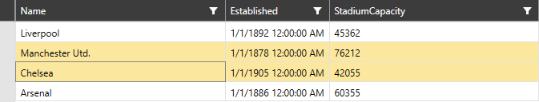

# Programmatic Selection

## Select Cell Region

__RadVirtualGrid__ supports selection of a cell region. This mechanism can be manipulated through the __SelectCellRegion__ method. It has two overloads.

* __SelectCellRegion(Telerik.Windows.Controls.VirtualGrid.CellRegion)__ - Expects a single __CellRegion__.

* __SelectCellRegion(IEnumerable<Telerik.Windows.Controls.VirtualGrid.CellRegion>)__ - Expects multiple __CellRegion__ elements.

#### __[C#] Example 1: Selecting a CellRegion__
	 this.VirtualGrid.SelectCellRegion
                (new Telerik.Windows.Controls.VirtualGrid.CellRegion(1, 1, 2, 5));

#### __Figure 1: Selecting a CellRegion__

## Selected Index and Selected Indexes

The control supports programmatic selection based on a given index/indexes. For this purpose, the __SelectedIndex__ and __SelectedIndexes__ properties are exposed.

> The index based selection of __RadVirtualGrid__ can be utilized only when the __SelectionUnit__ of the control is set to __Row__ or __Column__. Depending on the property value, the control will operate with either the index/indexes of the rows, or the columns.

* __SelectedIndex__ - provides information regarding the selected index of the control and can be assigned as well.

* __SelectedIndexes__ - provides information regarding the selected indexes. As it is a collection property it cannot be assigned.

#### __[C#] Example 2: Setting the SelectedIndex property__
	this.VirtualGrid.SelectedIndex = 1;

#### __Figure 2: Setting the SelectedIndex property__

#### __[C#] Example 3: Adding selected indexes__
	this.VirtualGrid.SelectedIndexes.Add(1);
    this.VirtualGrid.SelectedIndexes.Add(2);

#### __Figure 3: Adding selected indexes__

## See also

* [Selection]()

* [Multiple Selection]()

* [Editing]()

* [Insert and Remove Data]()

* [Pinned Rows and Columns]()