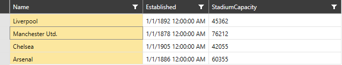

# Selection

This article will go through the selection mechanisms provided by __RadVirtualGrid__.

> The ability the user to be able to select rows or cells can be controlled through the __CanUserSelect__ boolean property.

## Selection Modes

__RadVirtualGrid__ provides three selection modes. The needed one can be applied through the __SelectionMode__ property, which is an enumeration that has the following values.

* __Single__ - only one item can be selected at a time. __(default value)__

* __Multiple__ - items are added to the selection when they get clicked and get removed when they get clicked again. 

* __Extended__ - items are added to the selection only by combining the mouse clicks with the __Ctrl__ or __Shift__ key. 

> More information regarding the __Multiple__ and __Extended__ selection can be found in the [Multiple Selection]() topic.

## Selection Units

The selection functionality of the control exposes three selection units. Manipulating it can be done through the __SelectionUnit__ enumeration. 

* __Cell__ - the clicked cell is selected only. Depending on the value of the __SelectionModes__ property you can have more than one selected cell. 

* __Row__ - this is the default value. Clicking within the cells will select the row. 

* __Column__ - clicking within the cells of a given column selects the whole column.

### Column Selection

When the __SelectionUnit__ of __RadVirtualGrid__ is set to __Column__, all cells within the selected column will be added to the __SelectedCells__ collection irrelevant to whether the __SelectionMode__ is set or not.

#### __Figure 2: RadVirtualGrid with SelectionUnit set to Column__


## Events

> The __AddedItems__ and __RemovedItems__ properties can be utilized only when the __SelectionInit__ of __RadVirtualGrid__ is set to __Row__ or __Column__.

* __SelectedCellsChanging__ - raised when the __SelectedCells__ collection is about to change. The event arguments expose the following specific properties: __AddedItems__ - a collection of the item(s) that has/have been added to the selection. __RemovedItems__ - a collection of the item(s) that has/have been removed from the selection. __IsCancelable__ - gets a value that indicates whether the event is cancelable. __Cancel__ - a boolean property that enables canceling the selection.

__Example 1: Subscribing to the SelectionCellsChanging event__

```C#
	private void VirtualGrid_SelectedCellsChanging(object sender, VirtualGridSelectedCellsChangingEventArgs e)
        {

        }
```

* __SelectedCellsChanged__ - raised when the __SelectedCells__ collection has changed. The event arguments expose the following specific properties: __AddedItems__ and __RemovedItems__. 

__Example 2: Subscribing to the SelectionCellsChanged event__

```C#
	private void VirtualGrid_SelectedCellsChanged(object sender, VirtualGridSelectedCellsChangedEventArgs e)
        {

        }
```

* __SelectionChanged__ - raised when the selection of the control has changed. It is triggered only when the __SelectionUnit__ is different from __Cell__. The event arguments expose the following specific properties: __AddedItems__ and __RemovedItems__. 

__Example 3: Subscribing to the SelectionChanged event__

```C#
	  private void VirtualGrid_SelectionChanged(object sender, SelectionChangedEventArgs e)
        {

        }
```

## See Also

* [Editing]()

* [Insert and Remove Data]()

* [Pinned Rows and Columns]()