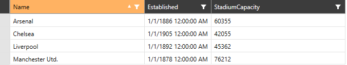

# Sorting with DataProvider

When __RadVirtualGrid__ populates its data through the __DataProvider__ mechanism, the sorting operation will be handled out-of-the-box. By default, the sorting of the control is enabled. The user can sort the data through the UI by clicking the column headers. Each click on a given column header will go to the consequent sorting state from one of the following ones: __Ascending__, __Descending__ and __No Sort__.

> The sorting of __RadVirtualGrid__ can be disabled by setting the __IsSortable__ property to __False__.

#### __Figure 1: Sorting RadVirtualGrid through the UI__


## Sorting through ColumnSortDescriptor

The __ColumnSortDescriptor__ of a given column can be fetched through the __GetSortDescriptorForColumn__ method of __RadVirtualGrid__ by providing the index of the needed column.

__Example 1: Getting the ColumnSortDescriptor of a column__

```C#
	var sortDescriptor = this.VirtualGrid.GetSortDescriptorForColumn(0);
```

Through the __ColumnSortDescriptor__, the sorting state can be set by manipulating its __SortDirection__ property.

> In order the UI to be updated accordingly, the __IsActive__ property of the given __SortDescriptor__ needs to be set to __True__.

__Example 2: Setting the SortDirection property__

```C#
	var sortDescriptor = this.VirtualGrid.GetSortDescriptorForColumn(0);
	sortDescriptor.SortDirection = System.ComponentModel.ListSortDirection.Ascending;
```

## See Also

* [Programmatic Sorting]()
