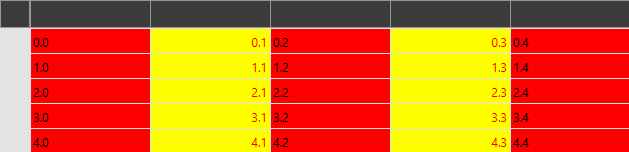

# Conditional Styling

This topic will demonstrate how the cells of `RadVirtualGrid` can be styled conditionally.

This is achieved through the usage of the following three events in conjunction.

* `OverlayBrushesNeeded`&mdash;The event arguments expose a `Brushes` collection which can be populated with the Brushes that will be conditionally applied further. When they are preliminarily known, the respective Geometry can be easily drawn at once, instead of applying a style for each cell individually. Thus, the rendering performance of the control is kept unaffected.

__Adding Brushes through the OverlayBrushesNeeded event__

```C#
	private void VirtualGrid_OverlayBrushesNeeded(object sender, 
            Telerik.Windows.Controls.VirtualGrid.OverlayBrushesEventArgs e)
        {
            e.Brushes.Add(Brushes.Red);
            e.Brushes.Add(Brushes.Yellow);
        }
```

* `CellDecorationsNeeded`&mdash;This is the event through which the actual styling of the cells can be applied. The event arguments expose the following properties:

	- `Background`&mdash;Its value must be set to be one of the Brushes provided by the `Brushes` collection populated through the `OverlayBrushesNeeded` event.
	- `ColumnIndex`&mdash;The column the given cell corresponds to.
	- `RowIndex`&mdash;The row the given cell corresponds to.
	- `FontFamily`&mdash;Sets the FontFamily of the cell.
	- `FontSize`&mdash;Sets the FontSize of the cell.
    - `FontStyle`&mdash;Sets the FontStyle of the cell.
    - `FontWeight`&mdash;Sets the FontWeight of the cell.
	- `Foreground`&mdash;Sets the Brush for the Foreground of the cell.
	- `CellTextAlignment`&mdash;Sets the cell's text alignment.
    - `CellTextPadding`&mdash;Sets the cell's text padding.

__Applying conditional styling through the CellDecorationsNeeded event__

```C#
	private void VirtualGrid_CellDecorationsNeeded(object sender, 
            Telerik.Windows.Controls.VirtualGrid.CellDecorationEventArgs e)
        {
            if (e.ColumnIndex % 2 == 0)
            {
                e.Background = Brushes.Red;
            }
            else
            {
                e.Background = Brushes.Yellow;
                e.Foreground = Brushes.Red;
                e.CellTextAlignment = TextAlignment.Right;
            }
        }
```

>For the effects of the `CellTextAlignment` property to be applied, the control's [MeasureTextOnRender](#measuretextonrender) property has to be set to `True`.

__RadVirtualGrid with conditional styling applied__



* `HeaderCellDecorationsNeeded`&mdash;This event allows for the styling of the header cells. Its event arguments are the same as the ones for the `CellDecorationsNeeded` event.

## See also

* [Styling and Appearance]()
