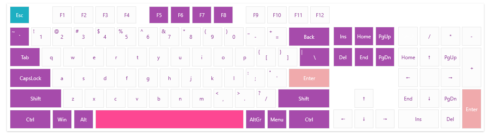

# Customizing Keys

The VirtualKeyboard component uses a DataTemplateSelector in order to determine the visual appearance of the keys. 

To customize the appearance, you can use the `VirtualKeyboardTemplateSelector` property of `RadVirtualKeyboard`. The following example shows how to define the selector with the default templates used by the VirtualKeyboard and modify their background, border and font size.

__Defining VirtualKeyboardTemplateSelector__
```XML
	<UserControl.Resources>
		<telerik:BooleanToVisibilityConverter x:Key="BooleanToVisibilityConverter" />
		<telerik:VirtualKeyboardTemplateSelector x:Key="KeyTemplateSelector">
			<telerik:VirtualKeyboardTemplateSelector.RegularTemplate>
				<DataTemplate>
					<telerik:RadButton Command="{Binding KeyCommand}" VerticalContentAlignment="Stretch" HorizontalContentAlignment="Stretch" Padding="0"
									   Background="Transparent" BorderBrush="#4cc297" BorderThickness="1" Foreground="#4cc297" FontSize="14">
						<Grid>
							<Grid.RowDefinitions>
								<RowDefinition/>
								<RowDefinition/>
							</Grid.RowDefinitions>
							<Grid.ColumnDefinitions>
								<ColumnDefinition/>
								<ColumnDefinition/>
							</Grid.ColumnDefinitions>
							<TextBlock Text="{Binding ShiftText}" 
									   Margin="3 0 0 0" 
									   Visibility="{Binding ShowSecondaryText, Converter={StaticResource BooleanToVisibilityConverter}}"/>
							<TextBlock Text="{Binding DisplayText}" Grid.RowSpan="2" Grid.ColumnSpan="2" HorizontalAlignment="Center" VerticalAlignment="Center"/>
						</Grid>
					</telerik:RadButton>
				</DataTemplate>
			</telerik:VirtualKeyboardTemplateSelector.RegularTemplate>
			<telerik:VirtualKeyboardTemplateSelector.SpecialTemplate>
				<DataTemplate>
					<telerik:RadButton Content="{Binding DisplayText}" Command="{Binding KeyCommand}" Padding="0"
									   Background="Transparent" BorderBrush="#4cc297" BorderThickness="1" Foreground="#4cc297" FontSize="14"/>
				</DataTemplate>
			</telerik:VirtualKeyboardTemplateSelector.SpecialTemplate>
			<telerik:VirtualKeyboardTemplateSelector.NumpadTemplate>
				<DataTemplate>
					<telerik:RadButton Content="{Binding DisplayText}" Command="{Binding KeyCommand}" Padding="0"
									   Background="Transparent" BorderBrush="#4cc297" BorderThickness="1" Foreground="#4cc297" FontSize="14"/>
				</DataTemplate>
			</telerik:VirtualKeyboardTemplateSelector.NumpadTemplate>
			<telerik:VirtualKeyboardTemplateSelector.LockTemplate>
				<DataTemplate>
					<telerik:RadToggleButton Content="{Binding DisplayText}" Command="{Binding KeyCommand}" IsChecked="{Binding IsChecked}" 
											 Background="Transparent" BorderBrush="#4cc297" BorderThickness="1" Foreground="#4cc297" FontSize="14"/>
				</DataTemplate>
			</telerik:VirtualKeyboardTemplateSelector.LockTemplate>
		</telerik:VirtualKeyboardTemplateSelector>
	</UserControl.Resources>		
```

__Setting the VirtualKeyboardTemplateSelector__
```XAML
	<telerik:RadVirtualKeyboard VirtualKeyboardTemplateSelector="{StaticResource KeyTemplateSelector}" />
```


>tip The DataContext objects provided to the DataTemplates of the selector are implementations of the `BaseKeyViewModel` class. Read more in the [Keys Layout](#keys-factory) article.

## Adding Custom Information in the Keys

To extend the visualization of the keys even further you can extend its view models. This will allow you to define additional properties that can be used in the `DataTemplates` of the VirtualKeyboardTemplateSelector. The  extended view models can be used by implementing custom [keys factory](#keys-factory) class. The following example shows how to add properties for the background and foreground of the buttons.

__Creating custom key view models in order to include background and foreground information__
```C#
	public class CustomLockKeyViewModel : LockKeyViewModel
    {
        public CustomLockKeyViewModel(int virtualKey, double keyWidth, double keyHeight, string displayText) 
            : base(virtualKey, keyWidth, keyHeight, displayText)
        {
        }

        public Brush Background { get; set; }
        public Brush Foreground { get; set; }
    }
	
	public class CustomModifierKeyViewModel : ModifierKeyViewModel
    {
        public CustomModifierKeyViewModel(int virtualKey, double keyWidth, double keyHeight, string displayText) 
            : base(virtualKey, keyWidth, keyHeight, displayText)
        {
        }

        public Brush Background { get; set; }
        public Brush Foreground { get; set; }
    }
	
	public class CustomNumpadKeyViewModel : NumpadKeyViewModel
    {
        public CustomNumpadKeyViewModel(int virtualKey, double keyWidth, double keyHeight, string displayText, int alternateVirtualKey, string alternateText) 
            : base(virtualKey, keyWidth, keyHeight, displayText, alternateVirtualKey, alternateText)
        {
        }

        public Brush Background { get; set; }
        public Brush Foreground { get; set; }
    }
	
	public class CustomRegularKeyViewModel : RegularKeyViewModel
    {
        public CustomRegularKeyViewModel(int virtualKey, double keyWidth, double keyHeight, bool showSecondaryText, string displayText = null) 
            : base(virtualKey, keyWidth, keyHeight, showSecondaryText, displayText)
        {
        }

        public Brush Background { get; set; }
        public Brush Foreground { get; set; }
    }
	
	public class CustomSpecialKeyViewModel : SpecialKeyViewModel
    {
        public CustomSpecialKeyViewModel(int virtualKey, double keyWidth, double keyHeight, string displayText) 
            : base(virtualKey, keyWidth, keyHeight, displayText)
        {
        }

        public Brush Background { get; set; }
        public Brush Foreground { get; set; }
    }
```

__Creating key factory__
```C#
	public class CustomKeyFactory : DefaultKeyFactory
    {
        private static readonly List<int> specialColorKeyCodes = new List<int>()
        {
            20, /*CapsLock*/  9, /*Tab*/ 192, /*tilde*/ 160, /*Shift*/
            161, /*Shift*/ 8, /*Backspace*/ 226, 162, /*Ctrl*/
            91, /*Win*/ 164, /*Alt*/ 165, /*AltGr*/ 93, /*Menu*/
            163,  /*Ctrl*/ 45, /*Ins*/ 33, /*PgUp*/ 36, /*Home*/
            34, /*PgDn*/ 35, /*End*/ 46, /*Del*/
            116, 117, 118, 119 /*F5 to F8*/
        };

        public Brush SpecialBrush { get; set; }
        public Brush EscapeBrush { get; set; }
        public Brush DefaultBrush { get; set; }
        public Brush EnterBrush { get; set; }
        public Brush SpaceBrush { get; set; }
        public Brush DefaultForeground { get; set; }
        
        public CustomKeyFactory() 
        {
            DefaultBrush = new SolidColorBrush((Color)ColorConverter.ConvertFromString("#FCFCFC"));
            SpecialBrush = new SolidColorBrush((Color)ColorConverter.ConvertFromString("#A64BAB"));
            SpaceBrush = new SolidColorBrush((Color)ColorConverter.ConvertFromString("#FD4792"));
            EscapeBrush = new SolidColorBrush((Color)ColorConverter.ConvertFromString("#1EAFC2"));
            EnterBrush = new SolidColorBrush((Color)ColorConverter.ConvertFromString("#F0AAAC"));
            DefaultForeground = new SolidColorBrush((Color)ColorConverter.ConvertFromString("#903C96"));
        }

        public override BaseKeyViewModel CreateKey(int virtualKey, KeyType keyType = KeyType.Normal, string displayText = null, double width = 1, double height = 1, int alternateVirtualKey = -1, string alternateText = null, bool showSecondaryText = false)
        {
            var keyModel = CreateCustomKey(virtualKey, keyType, displayText, width, height, alternateVirtualKey, alternateText, showSecondaryText);
            if (virtualKey == 27) // Esc
            {
                SetCustomViewModelProperty(keyModel, "Background", EscapeBrush);
                SetCustomViewModelProperty(keyModel, "Foreground", Brushes.White);
            }
            else if (virtualKey == 13) // Enter
            {
                SetCustomViewModelProperty(keyModel, "Background", EnterBrush);
                SetCustomViewModelProperty(keyModel, "Foreground", Brushes.White);
            }
            else if (virtualKey == 32) // Space
            {
                SetCustomViewModelProperty(keyModel, "Background", SpaceBrush);
            }
            else if (virtualKey == 144) // NmLk
            {
                SetCustomViewModelProperty(keyModel, "Foreground", Brushes.White);
            }
            else if (specialColorKeyCodes.Contains(virtualKey))
            {
                SetCustomViewModelProperty(keyModel, "Background", SpecialBrush);
                SetCustomViewModelProperty(keyModel, "Foreground", Brushes.White);
            }
            return keyModel;
        }

        private BaseKeyViewModel CreateCustomKey(int virtualKey, KeyType keyType, string displayText, double width, double height, int alternateVirtualKey, string alternateText, bool showSecondaryText)
        {
            switch (keyType)
            {
                case KeyType.Normal:
                    return new CustomRegularKeyViewModel(virtualKey, width, height, showSecondaryText, displayText) { Background = DefaultBrush, Foreground = DefaultForeground  };
                case KeyType.Special:
                    return new CustomSpecialKeyViewModel(virtualKey, width, height, displayText) { Background = DefaultBrush, Foreground = DefaultForeground };
                case KeyType.Modifier:
                    return new CustomLockKeyViewModel(virtualKey, width, height, displayText) { Background = DefaultBrush, Foreground = DefaultForeground };
                case KeyType.Lock:
                    return new CustomLockKeyViewModel(virtualKey, width, height, displayText) { Background = DefaultBrush, Foreground = DefaultForeground };
                case KeyType.Numpad:
                    return new CustomNumpadKeyViewModel(virtualKey, width, height, displayText, alternateVirtualKey, alternateText) { Background = DefaultBrush, Foreground = DefaultForeground };
                default:
                    throw new ArgumentException("Unknown key type");
            }
        }

        private static void SetCustomViewModelProperty(BaseKeyViewModel viewModel, string propertyName, object value)
        {
            var propertyInfo = viewModel.GetType().GetProperty(propertyName);
            if (propertyInfo != null)
            {
                propertyInfo.SetValue(viewModel, value);
            }
        }
    }
```

__Defining the key template selector__
```XAML
	<UserControl.Resources>
        <telerik:BooleanToVisibilityConverter x:Key="BooleanToVisibilityConverter" />
        <telerik:VirtualKeyboardTemplateSelector x:Key="KeyTemplateSelector">
            <telerik:VirtualKeyboardTemplateSelector.RegularTemplate>
                <DataTemplate>
                    <telerik:RadButton Command="{Binding KeyCommand}" VerticalContentAlignment="Stretch" HorizontalContentAlignment="Stretch" Padding="0"
                                       Background="{Binding Background}" Foreground="{Binding Foreground}">
                        <Grid>
                            <Grid.RowDefinitions>
                                <RowDefinition/>
                                <RowDefinition/>
                            </Grid.RowDefinitions>
                            <Grid.ColumnDefinitions>
                                <ColumnDefinition/>
                                <ColumnDefinition/>
                            </Grid.ColumnDefinitions>
                            <TextBlock Text="{Binding ShiftText}" 
                                       Margin="3 0 0 0" 
                                       Visibility="{Binding ShowSecondaryText, Converter={StaticResource BooleanToVisibilityConverter}}"/>
                            <TextBlock Text="{Binding DisplayText}" Grid.RowSpan="2" Grid.ColumnSpan="2" HorizontalAlignment="Center" VerticalAlignment="Center"/>
                        </Grid>
                    </telerik:RadButton>
                </DataTemplate>
            </telerik:VirtualKeyboardTemplateSelector.RegularTemplate>
            <telerik:VirtualKeyboardTemplateSelector.SpecialTemplate>
                <DataTemplate>
                    <telerik:RadButton Content="{Binding DisplayText}" Command="{Binding KeyCommand}" Padding="0"
                                       Background="{Binding Background}" Foreground="{Binding Foreground}"/>
                </DataTemplate>
            </telerik:VirtualKeyboardTemplateSelector.SpecialTemplate>
            <telerik:VirtualKeyboardTemplateSelector.NumpadTemplate>
                <DataTemplate>
                    <telerik:RadButton Content="{Binding DisplayText}" Command="{Binding KeyCommand}" Padding="0"
                                       Background="{Binding Background}" Foreground="{Binding Foreground}"/>
                </DataTemplate>
            </telerik:VirtualKeyboardTemplateSelector.NumpadTemplate>
            <telerik:VirtualKeyboardTemplateSelector.LockTemplate>
                <DataTemplate>
                    <telerik:RadToggleButton Content="{Binding DisplayText}" Command="{Binding KeyCommand}" IsChecked="{Binding IsChecked}" 
                                             Background="{Binding Background}" Foreground="{Binding Foreground}"/>
                </DataTemplate>
            </telerik:VirtualKeyboardTemplateSelector.LockTemplate>
        </telerik:VirtualKeyboardTemplateSelector>
    </UserControl.Resources>
```

__Setting the custom key factory and the template selector__
```XAML
	<telerik:RadVirtualKeyboard VirtualKeyboardTemplateSelector="{StaticResource KeyTemplateSelector}">
		<telerik:RadVirtualKeyboard.KeyFactory>
			<local:CustomKeyFactory />
		</telerik:RadVirtualKeyboard.KeyFactory>
	</telerik:RadVirtualKeyboard>
```



## See Also
* [Getting Started]()
