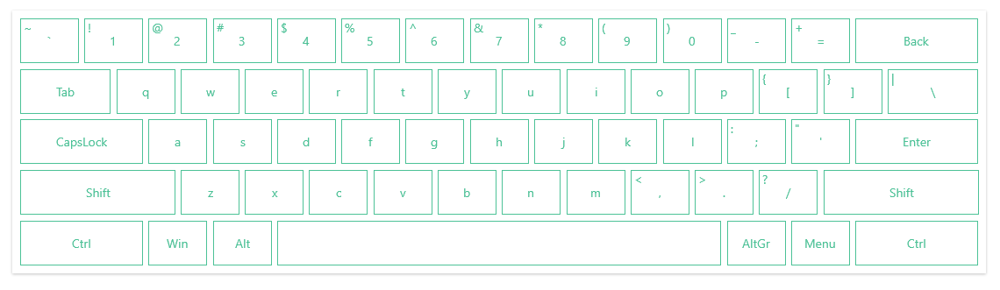
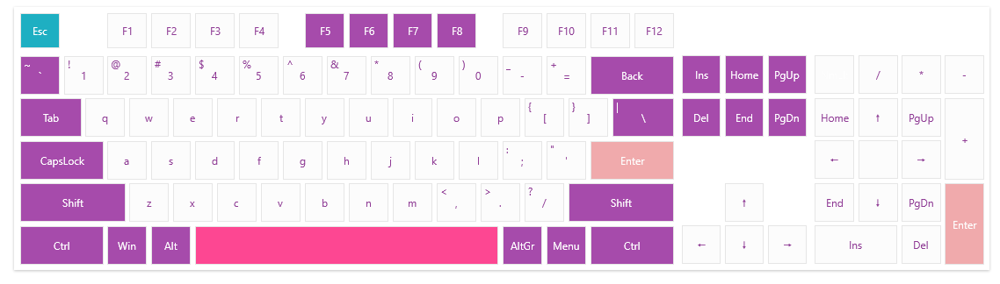

# Customizing Keys

The VirtualKeyboard component uses a DataTemplateSelector in order to determine the visual appearance of the keys. 

To customize the appearance, you can use the `VirtualKeyboardTemplateSelector` property of `RadVirtualKeyboard`. The following example shows how to define the selector with the default templates used by the VirtualKeyboard and modify their background, border and font size.

__Defining VirtualKeyboardTemplateSelector__
```XML
	<UserControl.Resources>
		<telerik:BooleanToVisibilityConverter x:Key="BooleanToVisibilityConverter" />
		<telerik:VirtualKeyboardTemplateSelector x:Key="KeyTemplateSelector">
			<telerik:VirtualKeyboardTemplateSelector.RegularTemplate>
				<DataTemplate>
					<telerik:RadButton Command="{Binding KeyCommand}" VerticalContentAlignment="Stretch" HorizontalContentAlignment="Stretch" Padding="0"
									   Background="Transparent" BorderBrush="#4cc297" BorderThickness="1" Foreground="#4cc297" FontSize="14">
						<Grid>
							<Grid.RowDefinitions>
								<RowDefinition/>
								<RowDefinition/>
							</Grid.RowDefinitions>
							<Grid.ColumnDefinitions>
								<ColumnDefinition/>
								<ColumnDefinition/>
							</Grid.ColumnDefinitions>
							<TextBlock Text="{Binding ShiftText}" 
									   Margin="3 0 0 0" 
									   Visibility="{Binding ShowSecondaryText, Converter={StaticResource BooleanToVisibilityConverter}}"/>
							<TextBlock Text="{Binding DisplayText}" Grid.RowSpan="2" Grid.ColumnSpan="2" HorizontalAlignment="Center" VerticalAlignment="Center"/>
						</Grid>
					</telerik:RadButton>
				</DataTemplate>
			</telerik:VirtualKeyboardTemplateSelector.RegularTemplate>
			<telerik:VirtualKeyboardTemplateSelector.SpecialTemplate>
				<DataTemplate>
					<telerik:RadButton Content="{Binding DisplayText}" Command="{Binding KeyCommand}" Padding="0"
									   Background="Transparent" BorderBrush="#4cc297" BorderThickness="1" Foreground="#4cc297" FontSize="14"/>
				</DataTemplate>
			</telerik:VirtualKeyboardTemplateSelector.SpecialTemplate>
			<telerik:VirtualKeyboardTemplateSelector.NumpadTemplate>
				<DataTemplate>
					<telerik:RadButton Content="{Binding DisplayText}" Command="{Binding KeyCommand}" Padding="0"
									   Background="Transparent" BorderBrush="#4cc297" BorderThickness="1" Foreground="#4cc297" FontSize="14"/>
				</DataTemplate>
			</telerik:VirtualKeyboardTemplateSelector.NumpadTemplate>
			<telerik:VirtualKeyboardTemplateSelector.LockTemplate>
				<DataTemplate>
					<telerik:RadToggleButton Content="{Binding DisplayText}" Command="{Binding KeyCommand}" IsChecked="{Binding IsChecked}" 
											 Background="Transparent" BorderBrush="#4cc297" BorderThickness="1" Foreground="#4cc297" FontSize="14"/>
				</DataTemplate>
			</telerik:VirtualKeyboardTemplateSelector.LockTemplate>
		</telerik:VirtualKeyboardTemplateSelector>
	</UserControl.Resources>		
```

__Setting the VirtualKeyboardTemplateSelector__
<snippet id='radvirtualkeyboard-appearance-customize-keys-block_1-xaml' />



>tip The DataContext objects provided to the DataTemplates of the selector are implementations of the `BaseKeyViewModel` class. Read more in the [Keys Layout](#keys-factory) article.

## Adding Custom Information in the Keys

To extend the visualization of the keys even further you can extend its view models. This will allow you to define additional properties that can be used in the `DataTemplates` of the VirtualKeyboardTemplateSelector. The  extended view models can be used by implementing custom [keys factory](#keys-factory) class. The following example shows how to add properties for the background and foreground of the buttons.

__Creating custom key view models in order to include background and foreground information__
<snippet id='radvirtualkeyboard-appearance-customize-keys-block_2-cs' />

__Creating key factory__
<snippet id='radvirtualkeyboard-appearance-customize-keys-block_3-cs' />

__Defining the key template selector__
<snippet id='radvirtualkeyboard-appearance-customize-keys-block_4-xaml' />

__Setting the custom key factory and the template selector__
<snippet id='radvirtualkeyboard-appearance-customize-keys-block_5-xaml' />



## See Also
* [Getting Started]()