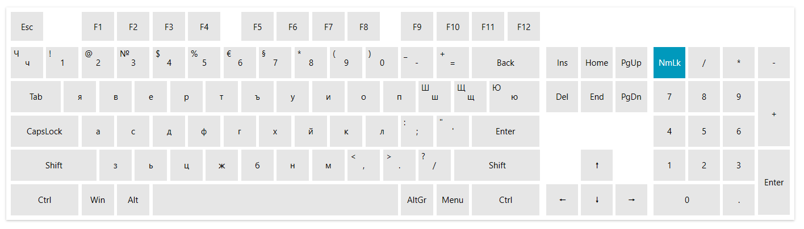

# Language Culture Support

A specific language culture can be applied to the buttons of the VirtualKeyboard in addition to the automatic language synchronization feature.

The language of the letter buttons in `RadVirtualKeyboard` is determined by the currently selected input language of the OS. Changing the input language at runtime won't affect the text in the letter buttons, until you set the `SynchronizeCultureWithSystem` property of `RadVirtualKeyboard` to `True`. This will enable the current input language tracking and it will update the text when the language changes at runtime.

__Enabling current language changed tracking at runtime__
```XAML	
	<telerik:RadVirtualKeyboard SynchronizeCultureWithSystem="True" />
```

The current language of the letters can be changed manually by setting the `Culture` property of `RadVirtualKeyboard`.

__Setting Bulgarian culture in order to change the language of the letters__
```XAML	
	virtualKeyboard.Culture = new System.Globalization.CultureInfo("bg-BG");
```



## See Also
* [Getting Started]()
* [Keys Layout]()
* [Sound]()
