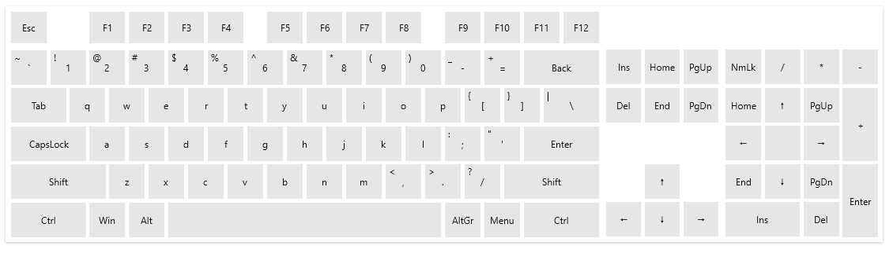

# Getting Started with {{ site.framework_name }} VirtualKeyboard

This tutorial will walk you through the creation of a sample application that contains a VirtualKeyboard control.

## Adding Telerik Assemblies Using NuGet

To use `RadVirtualKeyboard` when working with NuGet packages, install the `Telerik.Windows.Controls.Navigation.for.Wpf.Xaml` package. The [package name may vary]() slightly based on the Telerik dlls set - [Xaml or NoXaml]()

Read more about NuGet installation in the [Installing UI for WPF from NuGet Package]() article.

>tip With the 2025 Q1 release, the Telerik UI for WPF has a new licensing mechanism. You can learn more about it [here]().

## Adding Assembly References Manually

If you are not using NuGet packages, you can add a reference to the following assemblies:

* __Telerik.Licensing.Runtime__
* __Telerik.Windows.Controls__
* __Telerik.Windows.Controls.Navigation__

## Defining the RadVirtualKeyboard

#### __[XAML] Defining RadVirtualKeyboard in XAML__
{{region radvirtualkeyboard-getting-started-0}}
	 <telerik:RadVirtualKeyboard />
{{endregion}}

There is no need to manually subscribe an input element to the keyboard control. When you click a key on the VirtualKeyboard, a key press message is send to the OS. In addition to this, the control is unfocusable which means that if you focus a text input (like `TextBox` for example), the focus will stay there while you press the keys.


## Telerik UI for WPF Learning Resources

* [Telerik UI for WPF VirtualKeyboard Component](https://www.telerik.com/products/wpf/virtual-keyboard.aspx)
* [Getting Started with Telerik UI for WPF Components]()
* [Telerik UI for WPF Installation]()
* [Telerik UI for WPF and WinForms Integration]()
* [Telerik UI for WPF Visual Studio Templates]()
* [Setting a Theme with Telerik UI for WPF]()
* [Telerik UI for WPF Virtual Classroom (Training Courses for Registered Users)](https://learn.telerik.com/learn/course/external/view/elearning/16/telerik-ui-for-wpf) 
* [Telerik UI for WPF License Agreement](https://www.telerik.com/purchase/license-agreement/wpf-dlw-s)


## See Also  
* [Visual Structure]()
* [Keys Layout]()
* [Customize Keys]()
