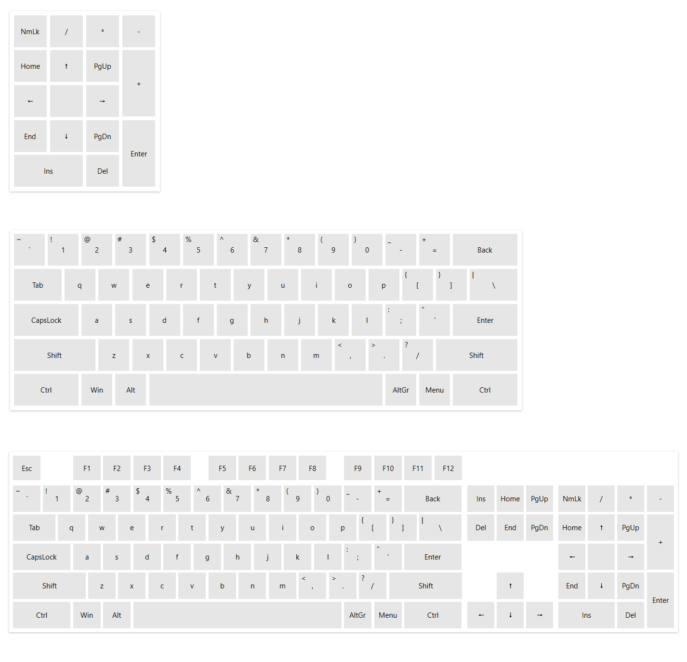

# Keys Layout

VirtualKeyboard comes with a set of predefined key layouts.

The default layout is an extended __QWERTY__, which includes the F keys, the arrows (cursor keys), numpad and other keys, like *Insert*, *PgUp*, *Home*, etc.

To change the layout using one of the predefined schemes, set the `DefaultKeyboardLayout` property of `RadVirtualKeyboard`. The property type is an enumeration with the following values:

* `Extended` (default)&mdash;Standard QWERTY 101-key layout, including F keys, arrows, numpad and other keys.

* `Compact`&mdash;Simplified QWERTY 101-key layout, without the F keys, arrows, numpad and other keys.

* `Numpad`&mdash;Only the numpad keys

#### __[XAML] Changing the default keyboard layout__
{{region radvirtualkeyboard-keys-layout-0}}	
	<telerik:RadVirtualKeyboard DefaultKeyboardLayout="Compact" />
{{endregion}}

__Predefined key layouts in the following order - Numpad, Compact and Extended__

## Creating Custom Key Layouts

To define custom keys layout you will need to create a special XML file and then load it using the `LoadLayout` method of `RadVirtualKeyboard`. The following markup shows a version of the XML format used to generate the default keyboard layout:

#### __[XML] Keys layout XML format example__
{{region radvirtualkeyboard-keys-layout-1}}	
	<RadVirtualKeyboard xmlns:xsi="http://www.w3.org/2001/XMLSchema-instance">
		<Grid>
			<Grid.RowDefinitions>
				<RowDefinition Height="1\*" />
				<RowDefinition Height="5\*" />
			</Grid.RowDefinitions>
			<Grid.ColumnDefinitions>
				<ColumnDefinition Width="15\*" />
				<ColumnDefinition Width="3\*" />
				<ColumnDefinition Width="4\*" />
			</Grid.ColumnDefinitions>
			<KeysLayout KeySpacing="0.1" Grid.Row="0" Grid.Column="0">
				<Rows>
					<Row>
						<Keys>
							<Key DisplayText="Esc" KeyType="Special" Width="1" Height="1" VirtualKey="27" />
							<EmptySpace Width="1" Height="1" />
							<Key DisplayText="F1" KeyType="Special" Width="1" Height="1" VirtualKey="112" />
							<Key DisplayText="F2" KeyType="Special" Width="1" Height="1" VirtualKey="113" />
							<Key DisplayText="F3" KeyType="Special" Width="1" Height="1" VirtualKey="114" />
							<Key DisplayText="F4" KeyType="Special" Width="1" Height="1" VirtualKey="115" />
							<EmptySpace Width="0.5" Height="1" />
							<Key DisplayText="F5" KeyType="Special" Width="1" Height="1" VirtualKey="116" />
							<Key DisplayText="F6" KeyType="Special" Width="1" Height="1" VirtualKey="117" />
							<Key DisplayText="F7" KeyType="Special" Width="1" Height="1" VirtualKey="118" />
							<Key DisplayText="F8" KeyType="Special" Width="1" Height="1" VirtualKey="119" />
							<EmptySpace Width="0.5" Height="1" />
							<Key DisplayText="F9" KeyType="Special" Width="1" Height="1" VirtualKey="120" />
							<Key DisplayText="F10" KeyType="Special" Width="1" Height="1" VirtualKey="121" />
							<Key DisplayText="F11" KeyType="Special" Width="1" Height="1" VirtualKey="122" />
							<Key DisplayText="F12" KeyType="Special" Width="1" Height="1" VirtualKey="123" />
						</Keys>
					</Row>
				</Rows>
			</KeysLayout>
			<KeysLayout KeySpacing="0.1" Grid.Row="1">
				<Rows>
					<Row>
						<Keys>
							<Key KeyType="Normal" ShowSecondaryText="True" Width="1" Height="1" VirtualKey="192" />
							<Key KeyType="Normal" ShowSecondaryText="True" Width="1" Height="1" VirtualKey="49" />
							<Key KeyType="Normal" ShowSecondaryText="True" Width="1" Height="1" VirtualKey="50" />
							<Key KeyType="Normal" ShowSecondaryText="True" Width="1" Height="1" VirtualKey="51" />
							<Key KeyType="Normal" ShowSecondaryText="True" Width="1" Height="1" VirtualKey="52" />
							<Key KeyType="Normal" ShowSecondaryText="True" Width="1" Height="1" VirtualKey="53" />
							<Key KeyType="Normal" ShowSecondaryText="True" Width="1" Height="1" VirtualKey="54" />
							<Key KeyType="Normal" ShowSecondaryText="True" Width="1" Height="1" VirtualKey="55" />
							<Key KeyType="Normal" ShowSecondaryText="True" Width="1" Height="1" VirtualKey="56" />
							<Key KeyType="Normal" ShowSecondaryText="True" Width="1" Height="1" VirtualKey="57" />
							<Key KeyType="Normal" ShowSecondaryText="True" Width="1" Height="1" VirtualKey="48" />
							<Key KeyType="Normal" ShowSecondaryText="True" Width="1" Height="1" VirtualKey="189" />
							<Key KeyType="Normal" ShowSecondaryText="True" Width="1" Height="1" VirtualKey="187" />
							<Key DisplayText="Back" KeyType="Special" Width="2" Height="1" VirtualKey="8" />
						</Keys>
					</Row>
					<Row>
						<Keys>
							<Key DisplayText="Tab" KeyType="Special" Width="1.5" Height="1" VirtualKey="9" />
							<Key KeyType="Normal" Width="1" Height="1" VirtualKey="81" />
							<Key KeyType="Normal" Width="1" Height="1" VirtualKey="87" />
							<Key KeyType="Normal" Width="1" Height="1" VirtualKey="69" />
							<Key KeyType="Normal" Width="1" Height="1" VirtualKey="82" />
							<Key KeyType="Normal" Width="1" Height="1" VirtualKey="84" />
							<Key KeyType="Normal" Width="1" Height="1" VirtualKey="89" />
							<Key KeyType="Normal" Width="1" Height="1" VirtualKey="85" />
							<Key KeyType="Normal" Width="1" Height="1" VirtualKey="73" />
							<Key KeyType="Normal" Width="1" Height="1" VirtualKey="79" />
							<Key KeyType="Normal" Width="1" Height="1" VirtualKey="80" />
							<Key KeyType="Normal" ShowSecondaryText="True" Width="1" Height="1" VirtualKey="219" />
							<Key KeyType="Normal" ShowSecondaryText="True" Width="1" Height="1" VirtualKey="221" />
							<Key KeyType="Normal" ShowSecondaryText="True" Width="1.5" Height="1" VirtualKey="226" />
						</Keys>
					</Row>
					<Row>
						<Keys>
						   <Key KeyType="Lock" Width="2" Height="1" VirtualKey="20" DisplayText="CapsLock" />
						   <Key KeyType="Normal" Width="1" Height="1" VirtualKey="65" />
						   <Key KeyType="Normal" Width="1" Height="1" VirtualKey="83" />
						   <Key KeyType="Normal" Width="1" Height="1" VirtualKey="68" />
						   <Key KeyType="Normal" Width="1" Height="1" VirtualKey="70" />
						   <Key KeyType="Normal" Width="1" Height="1" VirtualKey="71" />
						   <Key KeyType="Normal" Width="1" Height="1" VirtualKey="72" />
						   <Key KeyType="Normal" Width="1" Height="1" VirtualKey="74" />
						   <Key KeyType="Normal" Width="1" Height="1" VirtualKey="75" />
						   <Key KeyType="Normal" Width="1" Height="1" VirtualKey="76" />
						   <Key KeyType="Normal" ShowSecondaryText="True" Width="1" Height="1" VirtualKey="186" />
						   <Key KeyType="Normal" ShowSecondaryText="True" Width="1" Height="1" VirtualKey="222" />
						   <Key DisplayText="Enter" KeyType="Special" Width="2" Height="1" VirtualKey="13" />
						</Keys>
					</Row>
					<Row>
						<Keys>
							<Key KeyType="Modifier" Width="2.5" Height="1" VirtualKey="160" DisplayText="Shift" />
							<Key KeyType="Normal" Width="1" Height="1" VirtualKey="90" />
							<Key KeyType="Normal" Width="1" Height="1" VirtualKey="88" />
							<Key KeyType="Normal" Width="1" Height="1" VirtualKey="67" />
							<Key KeyType="Normal" Width="1" Height="1" VirtualKey="86" />
							<Key KeyType="Normal" Width="1" Height="1" VirtualKey="66" />
							<Key KeyType="Normal" Width="1" Height="1" VirtualKey="78" />
							<Key KeyType="Normal" Width="1" Height="1" VirtualKey="77" />
							<Key KeyType="Normal" ShowSecondaryText="True" Width="1" Height="1" VirtualKey="188" />
							<Key KeyType="Normal" ShowSecondaryText="True" Width="1" Height="1" VirtualKey="190" />
							<Key KeyType="Normal" ShowSecondaryText="True" Width="1" Height="1" VirtualKey="191" />
							<Key KeyType="Modifier" Width="2.5" Height="1" VirtualKey="161" DisplayText="Shift" />
						</Keys>
					</Row>
					<Row>
						<Keys>
							<Key KeyType="Modifier" Width="2" Height="1" VirtualKey="162" DisplayText="Ctrl" />
							<Key KeyType="Modifier" Width="1" Height="1" VirtualKey="91" DisplayText="Win" />
							<Key KeyType="Modifier" Width="1" Height="1" VirtualKey="164" DisplayText="Alt" />
							<Key DisplayText="" KeyType="Special" Width="7" Height="1" VirtualKey="32" />
							<Key KeyType="Modifier" Width="1" Height="1" VirtualKey="165" DisplayText="AltGr" />
							<Key KeyType="Modifier" Width="1" Height="1" VirtualKey="93" DisplayText="Menu" />
							<Key KeyType="Modifier" Width="2" Height="1" VirtualKey="163" DisplayText="Ctrl" />
						</Keys>
					</Row>
				</Rows>
			</KeysLayout>
			<KeysLayout KeySpacing="0.1" Grid.Row="1" Grid.Column="1">
				<Rows>
					<Row>
						<Keys>
							<Key DisplayText="Ins" KeyType="Special" Width="1" Height="1" VirtualKey="45" />
							<Key DisplayText="Home" KeyType="Special" Width="1" Height="1" VirtualKey="36" />
							<Key DisplayText="PgUp" KeyType="Special" Width="1" Height="1" VirtualKey="33" />
						</Keys>
					</Row>
					<Row>
						<Keys>
							<Key DisplayText="Del" KeyType="Special" Width="1" Height="1" VirtualKey="46" />
							<Key DisplayText="End" KeyType="Special" Width="1" Height="1" VirtualKey="35" />
							<Key DisplayText="PgDn" KeyType="Special" Width="1" Height="1" VirtualKey="34" />
						</Keys>
					</Row>
					<Row />
					<Row>
						<Keys>
							<EmptySpace Width="1" Height="1" />
							<Key DisplayText="🠕" KeyType="Special" Width="1" Height="1" VirtualKey="38" />
							<EmptySpace Width="1" Height="1" />
						</Keys>
					</Row>
					<Row>
						<Keys>
							<Key DisplayText="🠔" KeyType="Special" Width="1" Height="1" VirtualKey="37" />
							<Key DisplayText="🠗" KeyType="Special" Width="1" Height="1" VirtualKey="40" />
							<Key DisplayText="🠖" KeyType="Special" Width="1" Height="1" VirtualKey="39" />
						</Keys>
					</Row>
				</Rows>
			</KeysLayout>
			<KeysLayout KeySpacing="0.1" Grid.Row="1" Grid.Column="2">
				<Rows>
					<Row>
						<Keys>
							<Key KeyType="Lock" Width="1" Height="1" VirtualKey="144" DisplayText="NmLk" />
							<Key KeyType="Normal" Width="1" Height="1" VirtualKey="111" />
							<Key KeyType="Normal" Width="1" Height="1" VirtualKey="106" />
							<Key KeyType="Normal" Width="1" Height="1" VirtualKey="109" />
						</Keys>
					</Row>
					<Row>
						<Keys>
							<Key SecondaryVirtualKey="36" SecondaryDisplayText="Home" KeyType="Numpad" Width="1" Height="1" VirtualKey="103" />
							<Key SecondaryVirtualKey="38" SecondaryDisplayText="🠕" KeyType="Numpad" Width="1" Height="1" VirtualKey="104" />
							<Key SecondaryVirtualKey="33" SecondaryDisplayText="PgUp" KeyType="Numpad" Width="1" Height="1" VirtualKey="105" />
							<Key KeyType="Normal" Width="1" Height="2" VirtualKey="107" />
						</Keys>
					</Row>
					<Row>
						<Keys>
							<Key SecondaryVirtualKey="37" SecondaryDisplayText="🠔" KeyType="Numpad" Width="1" Height="1" VirtualKey="100" />
							<Key SecondaryVirtualKey="-1" SecondaryDisplayText="" KeyType="Numpad" Width="1" Height="1" VirtualKey="101" />
							<Key SecondaryVirtualKey="39" SecondaryDisplayText="🠖" KeyType="Numpad" Width="1" Height="1" VirtualKey="102" />
						</Keys>
					</Row>
					<Row>
						<Keys>
							<Key SecondaryVirtualKey="35" SecondaryDisplayText="End" KeyType="Numpad" Width="1" Height="1" VirtualKey="97" />
							<Key SecondaryVirtualKey="40" SecondaryDisplayText="🠗" KeyType="Numpad" Width="1" Height="1" VirtualKey="98" />
							<Key SecondaryVirtualKey="34" SecondaryDisplayText="PgDn" KeyType="Numpad" Width="1" Height="1" VirtualKey="99" />
							<Key DisplayText="Enter" KeyType="Special" Width="1" Height="2" VirtualKey="13" />
						</Keys>
					</Row>
					<Row>
						<Keys>
							<Key SecondaryVirtualKey="45" SecondaryDisplayText="Ins" KeyType="Numpad" Width="2" Height="1" VirtualKey="96" />
							<Key SecondaryVirtualKey="46" SecondaryDisplayText="Del" KeyType="Numpad" Width="1" Height="1" VirtualKey="110" />
						</Keys>
					</Row>
				</Rows>
			</KeysLayout>
		</Grid>
	</RadVirtualKeyboard>
{{endregion}}

The following list describes the tags used in the XML file:

* __RadVirtualKeyboard__&mdash;The root tag in the XML file.
* __Grid__&mdash;Defined like the `Grid` panel in WPF. You can define rows and columns where groups of keys can be placed.
* __KeysLayout__&mdash;Defines a group of keys that you can position in the rows and columns of the Grid using `Grid.Row` and `Grid.Column` attributes.

	The KeysLayout tag allows to also change the horizontal and vertical spacing between the keys by setting the `KeySpacing` attribute. The value is in relative units that determine the spacing based on the measured size of the keys. For example, spacing of 0.5 means 50% of the measured button's size. So, if the key is 100px wide, the horizontal spacing between the buttons will be 50px.

* __Rows__&mdash;Collection of rows in the layout. It contains __Row__ tags that describe a row in the current column (KeysLayout element).
* __Keys__&mdash;Collection of keys in the current rows.
* __Key__&mdash;Defines a key in the layout. It supports the following attributes that describe the key properties:
	* __DisplayText__&mdash;The text displayed in the key button. 
	* __VirtualKey__&mdash;The key code on the keyboard. This value is used to send to corresponding key event to the OS. If the __DisplayText__ is not set, the virtual key will be used to fetch the text of the key.
	* __SecondaryDisplayText__&mdash;The alternative text displayed in the key button when the NumLock key is toggled.
	* __SecondaryVirtualKey__&mdash;The alternative key code on the keyboard that is activated when the NumLock button is toggled.
	* __KeyType__&mdash;Defines the type of the defined key. This determines the visuals appearance and the behavior of the key in the UI. The KeyType can be `Normal`, `Special`, `Modifier`, `Lock` and `Numpad`.
	* __Width__&mdash;The width of the key in relative units. A value of `1` means 1 time the width a key. The width of a key is calculated at runtime based on the available space and the keys count. A value of `0.5` means a half button size.
	* __Height__&mdash;The height of the key in relative units.
	* __ShowSecondaryText__&mdash;Determines if the secondary text (based on the VirtualKey value) should be displayed. An example for secondary text is the *!* character on the key for number *1*, or the *@* character in the key *2*.

>important The parsing of `double` values in the XML is performed with [CultureInfo.InvariantCulture](https://learn.microsoft.com/en-us/dotnet/api/system.globalization.cultureinfo.invariantculture) meaning that a dot (`.`) needs to be used as the decimal separator.
	
#### Loading Key Layout XML Files

Once the XML file with the layout is defined, you can load it using the `LoadLayout` method of `RadVirtualKeyboard`. The method allows you to provide an XML `string` or a `Stream` with the XML file information. In order to load the XML file when using the approach with the Stream, you may need to set its __Build Action__ in Visual Studio's Properties menu to __Resource__.

#### __[C#] LoadLayout call with a string argument__
{{region radvirtualkeyboard-keys-layout-2}}	
	virtualKeyboard.LoadLayout(xmlString);
{{endregion}}

#### __[C#] LoadLayout call with a Stream argument__
{{region radvirtualkeyboard-keys-layout-3}}	
	StreamResourceInfo info = Application.GetResourceStream(new Uri(@"/WpfApplication;component/keys-layout-file.xml", UriKind.Relative));
	virtualKeyboard.LoadLayout(info.Stream);
{{endregion}}

When the file is loaded, the control parses the XML and provides its values to the key factory that creates view models for the buttons. The key factory can be accessed or replaced through the `KeyFactory` property of `RadVirtualKeyboard`. The default key factory implementation is the `DefaultKeyFactory` class. Implementing a custom factory class will allow you to provide extended key view models (`BaseKeyViewModel`) in case you need to customize the keys appearance and functionalities.

#### Reset the Default Keys Layout

When the `LoadLayout` method is used to load custom layout, the `DefaultKeyboardLayout` property is no longer applicable. Changing its value won't do anything. To enable the property again and return the default keys layouts, call the `LoadLayout` method with a `null` value.

#### __[C#] Reset the default layout__
{{region radvirtualkeyboard-keys-layout-4}}		
	  virtualKeyboard.LoadLayout(filename:null);
{{endregion}}

## Keys Factory

The keys factory creates the view models of the buttons after the corresponding XML layout file is loaded. For each __Key__ tag in the file a new `BaseKeyViewModel`. The __KeyType__ attribute of the Key tag determines the concrete view model implementation that will be created. The following list shows the available view models, where each class has its own additional set of properties.

* `LockKeyViewModel`
* `ModifierKeyViewModel`
* `NumpadKeyViewModel`
* `RegularKeyViewModel`
* `SpecialKeyViewModel`

The key factory is represented by the `DefaultKeyFactory` class which can be used to customize the view models creation. You can access or replace the default factory using the `KeyFactory` property of `RadVirtualKeyboard`. You can find an example showing how to implement a custom key factory in the [Customizing Keys](#adding-custom-information-in-the-keys) article.

## See Also
* [Getting Started]()
* [Visual Structure]()
* [Customize Keys]()
