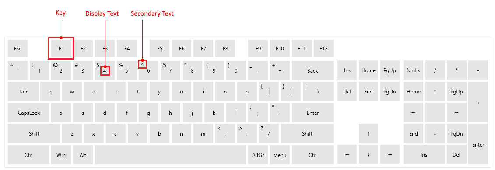

# Visual Structure

This section defines terms and concepts used in the scope of the `RadVirtualKeyboard` control with which you have to get familiar before you continue to read its documentation. They can also be helpful when contacting our support service in order to describe your issue better.

* __Key__&mdash;An element representing a key button on the keyboard.

* __Display Text__&mdash;The main text in the key. The display text may change when Num Lock is pressed.

* __Secondary Text__&mdash;Additional text displayed at the top left button of the key.

>tip Get started with the control with its [Getting Started]() help article that shows how to use it in a basic scenario.

## See Also  
* [Getting Started]()
* [Visual Structure]()
* [Customize Keys]()
