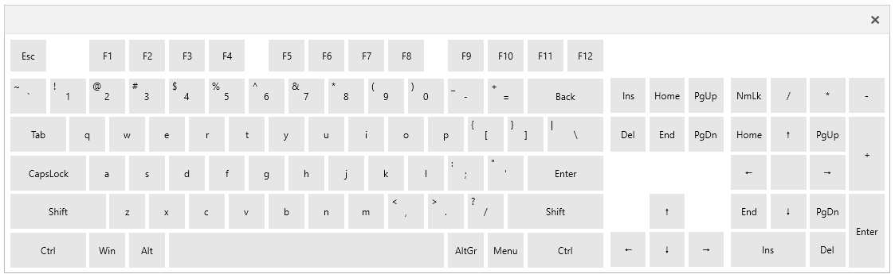

# Keyboard Window

VirtualKeyboard provides a special window element that is styled according to the keyboard design.

To open the keyboard window, use the `RadVirtualKeyboardWindow` control and its `Show` method. 

__Showing RadVirtualKeyboardWindow__
```C#
	var keyboardWindow = new RadVirtualKeyboardWindow(new RadVirtualKeyboard());
	keyboardWindow.Show();
```



## See Also  
* [Visual Structure]()
* [Keys Layout]()
* [Customize Keys]()
