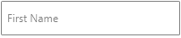
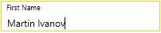
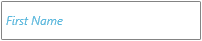

# Label

The label feature allows you to display additional information about the text.

The label displays as a watermark content (placeholder) when the RadWatermarkTextBox control is unfocused and the text is empty. When the control gets focused or any text is entered, the label is positioned on top (floating) of the text input area.

__Setting the Label property__
<snippet id='radwatermarktextbox-embedded-label-block_1-xaml' />

#### Label default visualization  

#### Label visualization when floated  

To keep the label always positioned on top of the text input area, set the __KeepLabelFloated__ property of RadWatermarkTextBox to True.

__Setting the KeepLabelFloated property__
<snippet id='radwatermarktextbox-embedded-label-block_2-xaml' />

To get the current state of the label, use the __IsLabelFloated__ property of RadWatermarkTextBox.

__Getting the state of the label__
<snippet id='radwatermarktextbox-embedded-label-block_3-cs' />

## Customizing Appearance

The label visual element is of type `Telerik.Windows.Controls.Label`. To customize its appearance, use the `LabelStyle` property of `RadWatermarkTextBox`.

__Customizing the label__
<snippet id='radwatermarktextbox-embedded-label-block_4-xaml' />

#### Customized label  

## Animation

The label comes with a built-in animation that moves the label on top of the input text and then return it back to the center when necessary. This feature is enabled using Telerik's `AnimationManager` class. To change the animation, set the attached `AnimationManager.AnimationSelector` property on the RadWatermarkTextBox control. The property allows you to define an `AnimationSelector` with two groups describing the two animations that appear - make the label floating and return it to the text input area (the center).

The following example shows the default `AnimationSelector` used with the control but with slightly changed `Duration` of the animations.

__Customizing the label__
<snippet id='radwatermarktextbox-embedded-label-block_5-xaml' />

## See also  
* [Overview]()
* [Getting Started]()