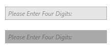
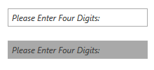
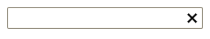

# Features

The most important properties of the `RadWatermarkTextBox` control are:      

* `WatermarkContent`&mdash;Gets or sets the content to be shown when the TextBox is empty and not focused.

* `WatermarkTemplate`&mdash;Gets or sets the template for presenting the content, shown when the TextBox is empty and not focused.

* `CurrentText`&mdash;Gets or sets the text of the TextBox. This property is meant to be used for TwoWay binding in order to be updated on each change of the text and not when the focus is lost.

* `IsWatermarkVisible`&mdash;A read-only property indicating whether the Watermark is visible or not.

* `SelectionOnFocus`&mdash;Specifies the modification over the selection when the control receives focus. The values for this properties are predefined in the `SelectionOnFocus` enumeration, which exposes the following fields:

	* `Unchanged`&mdash;Selection will not be modified.

	* `SelectAll`&mdash;The whole text will be selected.

	* `CaretToBeginning`&mdash;The caret will be moved at the start of the text.

	* `CaretToEnd`&mdash;The caret will be moved at the end of the text.

* `AdditionalContent`&mdash;Gets or sets an object which is rendered in ContentPresenter in the right part of the control.

* `AdditionalContentTemplate`&mdash;Gets or sets the System.Windows.DataTemplate used for the AdditionalContent object.

>tip The `RadWatermarkTextBox` control is part of the __Telerik.Windows.Controls.dll__ assembly.

## Using the WatermarkContent Property

In scenarios, where you want to show custom content, when an empty string is entered, you need to use the WatermarkContent property.

In the following example, the user is asked to enter four digits:

__Setting the WatermarkContent property__
```XAML
	<telerik:RadWatermarkTextBox x:Name="radWatermarkTextBox" WatermarkContent="Please Enter Four Digits:" />
```

__RadWatermarkTextBox with watermark text__


The WatermarkContent property is of type `object`, which means that you can set a value of any type. For example:

__Defining custom content for the WatermarkContent property__
```XAML
	<telerik:RadWatermarkTextBox x:Name="radWatermarkTextBox1">
	    <telerik:RadWatermarkTextBox.WatermarkContent>
	        <StackPanel Orientation="Horizontal">
	            <Image Source="/Silverlight.Help.RadMaskedTextBox;component/Images/EURFlag.png" />
	            <TextBlock Margin="3,0,0,0" Text="Please Enter Four Digits" />
	        </StackPanel>
	    </telerik:RadWatermarkTextBox.WatermarkContent>
	</telerik:RadWatermarkTextBox>
```

__RadWatermarkTextBox with custom watermark content__


## Using WatermarkTemplate Property

Similarly, you can use the `WatermarkTemplate` property for the same sort of scenarios. Note that in this case you should define a new `DataTemplate` for the WatermarkTemplate property.

__Defining the WatermarkTemplate__
```XAML
	<telerik:RadWatermarkTextBox x:Name="radWatermarkTextBox2">
	    <telerik:RadWatermarkTextBox.WatermarkTemplate>
	        <DataTemplate>
	            <StackPanel Orientation="Horizontal">
	                <Image Source="/Silverlight.Help.RadMaskedTextBox;component/Images/EURFlag.png" />
	                <TextBlock Margin="3,0,0,0" Text="Please Enter Four Digits" />
	            </StackPanel>
	        </DataTemplate>
	    </telerik:RadWatermarkTextBox.WatermarkTemplate>
	</telerik:RadWatermarkTextBox>
```

__RadWatermarkTextBox with custom WatermarkTemplate__


## Setting the SelectionOnFocus Property

The `SelectionOnFocus` property of RadWatermarkTextBox allows you to specify what will happen with the cursor when the control gets focus. In the following example the SelectionOnFocus property is set to `SelectAll`. Once the RadWatermarkTextBox gets focused, it will select its whole text.

__Setting the SelectionOnFocus property__
```XAML
	<telerik:RadWatermarkTextBox x:Name="radWatermarkTextBox3" 
	                             SelectionOnFocus="SelectAll"
	                             WatermarkContent="Please Enter Four Digits:" />
```

## WatermarkBehavior

`WatermarkBehavior` is an enumeration property which specifies when the watermark content of RadWatermarkTextBox will be hidden.  It could receive the following values:

* `HiddenWhenFocused`&mdash;The watermark will be hidden when the RadWatermarkTextBox receives focus
* `HideOnClick`&mdash;The watermark will be hidden when the the user clicks on the RadWatermarkTextBox
* `HideOnTextEntered`&mdash;The watermark will be hidden when the the user writes text into the RadWatermarkTextBox

The default value is `HiddenWhenFocused`.

## ReadOnlyBackground and DisabledBackground

RadWatermarkTextBox control exposes two properties to set its background when it's in a disabled or in read-only state. The properties are named `DisabledBackground` and `ReadOnlyBackground` respectively.

__Setting the DisabledBackground property__
```XAML
        <telerik:RadWatermarkTextBox WatermarkContent="Please Enter Four Digits:" IsEnabled="False" DisabledBackground="DarkGray" />
```

__Disabled RadWatermarkTextBox with and without DisabledBackground__



__Setting the ReadOnlyBackground property__
```XAML
        <telerik:RadWatermarkTextBox WatermarkContent="Please Enter Four Digits:" IsReadOnly="True" ReadOnlyBackground="DarkGray" />
```

__Read-only RadWatermarkTextBox with and without ReadOnlyBackground__



>Please note that the read-only visual is drawn over the disabled visual so the ReadOnlyBackground will take precedence over the DisabledBackground if the control is in both the disabled and read-only states.

## Clear Command

The `RadWatermarkTextBoxCommands` class, exposes the `Clear` command which clears the content of the textbox. 

__Using the Clear Command__
```XAML
	<StackPanel>
        <telerik:RadWatermarkTextBox x:Name="watermarkTextBox" />

        <telerik:RadButton Command="telerik:RadWatermarkTextBoxCommands.Clear"
                           CommandTarget="{Binding ElementName=watermarkTextBox}">
            <telerik:RadGlyph Glyph="&#xe11b;"  />
        </telerik:RadButton>
    </StackPanel>
```

## AdditionalContent and AdditionalContentTemplate

The RadWatermarkTextBox control exposes two properties, which allow for displaying additional content on its right side. Those are `AdditionalContent` and `AdditionalContentTemplate`.

The following example demonstrates the `AdditionalContent` and `AdditionalContentTemplate` properties along with the `Clear` command.

__Setting the AdditionalContent and AdditionalContentTemplate properties__
```XAML
	<Grid>
	    <Grid.Resources>
	        <DataTemplate x:Key="ClearWatermarkTextBoxAdditionalContentTemplate">
	            <telerik:RadButton Focusable="False" 
	                       IsBackgroundVisible="False" 
	                       Command="telerik:RadWatermarkTextBoxCommands.Clear" 
	                       CommandTarget="{Binding ElementName=watermarkTextBox}">
	                <telerik:RadGlyph Glyph="{Binding}"/>
	            </telerik:RadButton>
	        </DataTemplate>
	    </Grid.Resources>
	    <telerik:RadWatermarkTextBox Name="watermarkTextBox"
	                                 AdditionalContent="&#xe11b;"
	                                 AdditionalContentTemplate="{StaticResource ClearWatermarkTextBoxAdditionalContentTemplate}"/>
	</Grid>
```

__RadWatermarkTextBox with custom AdditionalContent and AdditionalContentTemplate properties__



## See also

* [Overview]()
