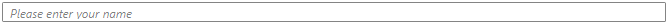

# Getting Started with {{ site.framework_name }} WatermarkTextBox

This tutorial will walk you through the required steps for using __RadWatermarkTextBox__. 

* [Assembly References](#assembly-references)
* [Setting the WatermarkContent](#setting-watermark-content)

## Adding Telerik Assemblies Using NuGet

To use __RadWatermarkTextBox__ when working with NuGet packages, install the `Telerik.Windows.Controls.for.Wpf.Xaml` package. The [package name may vary]() slightly based on the Telerik dlls set - [Xaml or NoXaml]()

Read more about NuGet installation in the [Installing UI for WPF from NuGet Package]() article.

>tip With the 2025 Q1 release, the Telerik UI for WPF has a new licensing mechanism. You can learn more about it [here]().

## Adding Assembly References Manually

If you are not using NuGet packages, you can add a reference to the following assemblies:

* __Telerik.Licensing.Runtime__
* __Telerik.Windows.Controls__

## Adding RadWatermarkTextBox to the Project 

#### __[XAML] Example 1: Defining RadWatermarkTextBox__
{{region radwatermarktextbox-gettingstarted_0}}
	<telerik:RadWatermarkTextBox/>
{{endregion}}

#### __Figure 1: Defining RadWatermarkTextBox__

## Setting the WatermarkContent

> __RadWatermarkTextBox__ supports setting its __WatermarkContent__ or __WatermarkTemplate__ for visualizing the needed information. These mechanisms are covered in details in the [Features]() topic.

#### __[XAML] Example 2: Setting the WatermarkContent__
{{region radwatermarktextbox-gettingstarted_1}}
	<telerik:RadWatermarkTextBox WatermarkContent="Please enter your name"/>
{{endregion}}

#### __Figure 2: Setting the WatermarkContent__

## Setting a Theme

The controls from our suite support different themes. You can see how to apply a theme different than the default one in the [Setting a Theme]() help article.

>important Changing the theme using implicit styles will affect all controls that have styles defined in the merged resource dictionaries. This is applicable only for the controls in the scope in which the resources are merged. 

To change the theme, you can follow the steps below:
* Choose between the themes and add reference to the corresponding theme assembly (ex: **Telerik.Windows.Themes.Windows8.dll**). You can see the different themes applied in the **Theming** examples from our [WPF Controls Examples](https://demos.telerik.com/wpf/)[Silverlight Controls Examples](https://demos.telerik.com/silverlight/#GridView/Theming) application.

* Merge the ResourceDictionaries with the namespace required for the controls that you are using from the theme assembly. For RadWatermarkTextBox, you will need to merge the following resources:

	* __Telerik.Windows.Controls__

__Example 3__ demonstrates how to merge the ResourceDictionaries so that they are applied globally for the entire application.

#### __[XAML] Example 3: Merge the ResourceDictionaries__  
{{region radwatermarktextbox-getting-started_08}}
		<Application.Resources>
			<ResourceDictionary>
				<ResourceDictionary.MergedDictionaries>
	                <ResourceDictionary Source="/Telerik.Windows.Themes.Windows8;component/Themes/System.Windows.xaml"/>
	                <ResourceDictionary Source="/Telerik.Windows.Themes.Windows8;component/Themes/Telerik.Windows.Controls.xaml"/>
				</ResourceDictionary.MergedDictionaries>
			</ResourceDictionary>
		</Application.Resources>
{{endregion}}

__Figure 3__ shows RadWatermarkTextBox with the **Windows8** theme applied.
	
#### __Figure 3: RadWatermarkTextBox with the Windows8 theme__

## See also

* [Overview]()
* [Features]()


## Telerik UI for WPF Learning Resources

* [Telerik UI for WPF WatermarkTextBox Component](https://www.telerik.com/products/wpf/watermarktextbox.aspx)
* [Getting Started with Telerik UI for WPF Components]()
* [Telerik UI for WPF Installation]()
* [Telerik UI for WPF and WinForms Integration]()
* [Telerik UI for WPF Visual Studio Templates]()
* [Setting a Theme with Telerik UI for WPF]()
* [Telerik UI for WPF Virtual Classroom (Training Courses for Registered Users)](https://learn.telerik.com/learn/course/external/view/elearning/16/telerik-ui-for-wpf) 
* [Telerik UI for WPF License Agreement](https://www.telerik.com/purchase/license-agreement/wpf-dlw-s)


