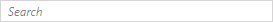

# {{ site.framework_name }} WatermarkTextBox Overview

__RadWatermarkTextBox__ control represents a TextBox that allows you to define a placeholder to be displayed when the content is empty and the control is not focused. This is useful when you want to display additional information when having an empty text input control.





## Key Features

* __Empty (watermark) content__: This allows you to give guidance to the end user on what should be enter in the text input. The watermark content is displayed when the control is empty and not focused.

* __Customizeable watermark content__: You can easily change the watermark content and content template of the control.

* __Selection on focus__: The control gives you the ability to select all text when it gets the focus.

* __Different watermark behaviors__: You can tell the control when to hide the watermark content - on focus, on click or on text entered.

* __Embedded label support__: This allows you to provide a label describing the text input. Read more in the [Label]() article.


> Check out the online demo at [demos.telerik.com](http://demos.telerik.com/silverlight/#WatermarkTextBox/FirstLook)[demos.telerik.com](http://demos.telerik.com/wpf/)

## See also
 * [Features]()

 


## Telerik UI for WPF Support and Learning Resources

* [Telerik UI for WPF WatermarkTextBox Homepage](https://www.telerik.com/products/wpf/watermarktextbox.aspx)
* [Get Started with the Telerik UI for WPF WatermarkTextBox]()
* [Telerik UI for WPF API Reference](https://docs.telerik.com/devtools/wpf/api/)
* [Getting Started with Telerik UI for WPF Components]()
* [Telerik UI for WPF Virtual Classroom (Training Courses for Registered Users)](https://learn.telerik.com/learn/course/external/view/elearning/16/telerik-ui-for-wpf) 
* [Telerik UI for WPF WatermarkTextBox Forums](https://www.telerik.com/forums/wpf)
* [Telerik UI for WPF Knowledge Base](https://docs.telerik.com/devtools/wpf/knowledge-base)


