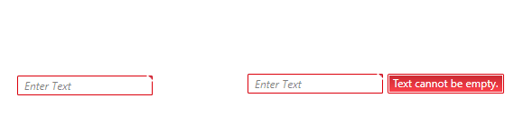

# ValidationErrorTemplateHelper

When the control has validation errors, the border around the control will turn red and a little element will appear in the upper right corner of the control. When you hover over the element you can read the validation message. By default, the validation error tooltip message will appear only when the mouse is over this element.



To make the validation message appears when the control is focused, you can set the __ValidationErrorTemplateHelper.ShowWhenFocused__ attached property to true. Its default value is false.

__Example 1: Show Validation Message on Focus__
```XAML
	<telerik:RadWatermarkTextBox telerik:ValidationErrorTemplateHelper.ShowWhenFocused="True" />
```

## See also
 * [Features]()

 
