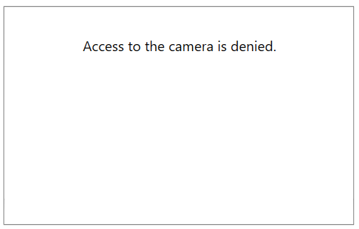

# Events

`RadWebCam` exposes the following events, specific for the control.

## SnapshotTaken

The SnapshotTaken event fires when the "Take snapshot" button is pressed or when you call the `TakeSnapshot` method of RadWebCam.

The purpose of the event is to notify you that a snapshot has been taken and you need to take action, like saving it to a file.

The event arguments are of type `SnapshotTakenEventArgs` which expose a `Snapshot` property (of type BitmapSource).

__Subscribing to the SnapshotTaken event__
<snippet id='radwebcam-events-block_1-cs' />

## CameraError

The `CameraError` event fires when one of the [expected camera errors](#error-types) appears.

The event can be used to notify you about the corresponding error, or to replace the error message shown in the control.

The event arguments are of type `CameraErrorEventArgs` and they expose an `Error` property that contains information about the error. The Error property is of type `ErrorInfo` which gives you access to the message and state of the error via the `Message` and `ErrorState` properties.

__Subscribing to the CameraError event and replacing the no-camera error message__
<snippet id='radwebcam-events-block_2-cs' />

__Customized error message__

## RecordingStarted/Ended

The `RecordingStarted` event fires just before the camera control starts recording. 

The event arguments are of type `RecordingStartedEventArgs` and can be used to cancel the recording start. To do this, set the `Cancel` property to True.

__Canceling the start recording action__
<snippet id='radwebcam-events-block_3-cs' />

The `RecordingEnded` event fires when the camera control stops recording. 

>tip Read more about the video capturing in the [Recording Video]() article.

## See Also  
* [Getting Started]()
* [Visual Structure]()
* [Snapshots]()
* [Errors]()