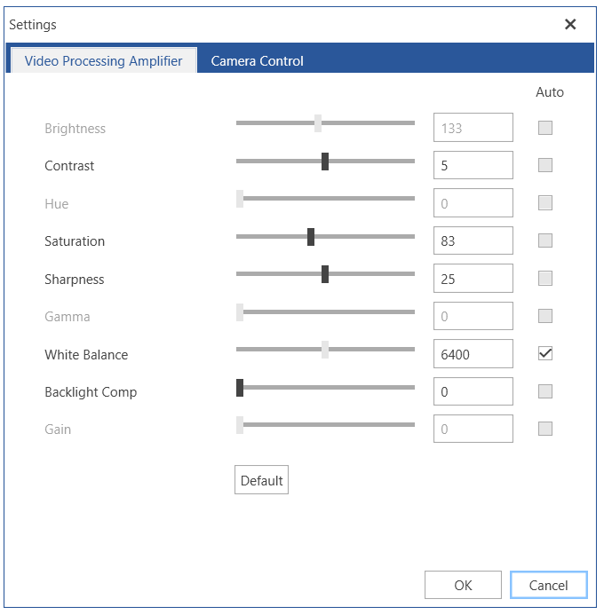
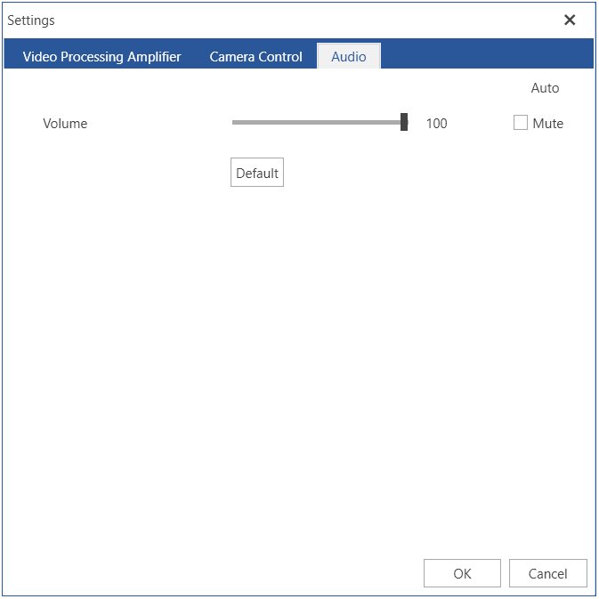

# Camera Settings Control

The RadWebCam component allows you to control the settings of the connected camera. You can do this using the settings dialog which opens when you press the [Open settings dialog]() button.

__Settings dialog__



>important The changes applied via the settings controls reflect the settings of the camera device. This means that when you close the application, the setting will still apply to the device.

You can also use the `CameraSettingsControl` as a stand alone element.

__Using CameraSettingsControl__
```XAML
	<Grid>
		<Grid.ColumnDefinitions>
			<ColumnDefinition />
			<ColumnDefinition />
		</Grid.ColumnDefinitions>
		<telerik:RadWebCam x:Name="radWebCam" />
		<telerik:CameraSettingsControl WebCam="{Binding ElementName=radWebCam}" Grid.Column="1"/>
	</Grid>
```

## Showing Audio Settings

The `ShowAudioSettings` property allows you to control the addition of the Audio tab inside the settings dialog. Through the included tab you can control the microphone's settings.

>important The Audio tab will automatically appear if a microphone is provided during the initialization of the camera.

__Adding the Audio Tab__
```XAML
	<telerik:CameraSettingsControl WebCam="{Binding ElementName=radWebCam}" ShowAudioSettings="True"/>
```

__Audio Tab__



## See Also  
* [Getting Started]()
* [SnapshotTaken]()
* [Recording Video]()
