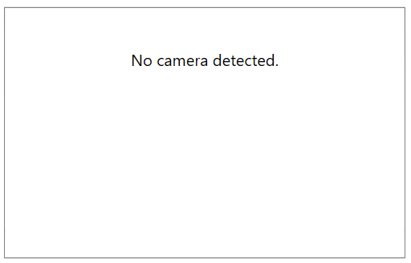
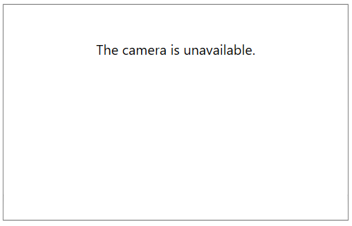
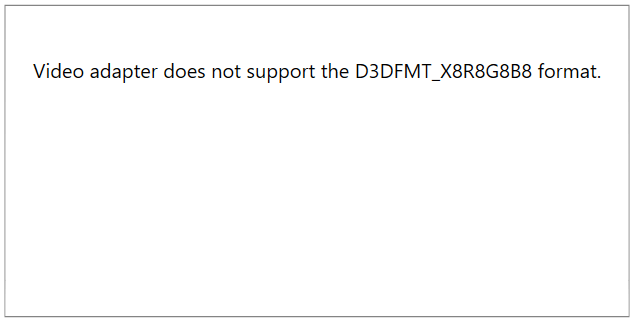
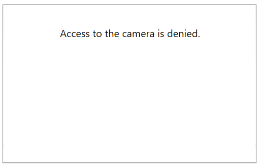
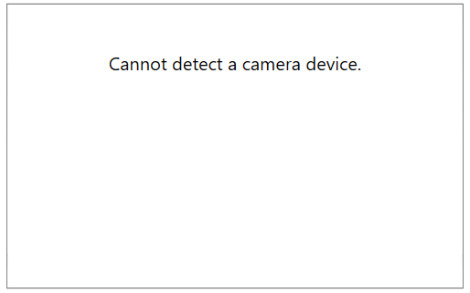
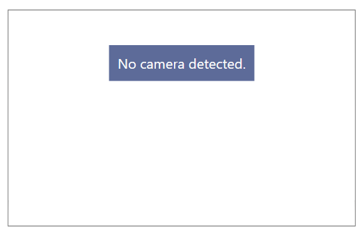

# Errors

This article demonstrates how to customize the error content shown when one of the few known camera errors appear. 

When one of the following errors appear, the camera buttons and player get replaced by an error message presenter.

## Error Types

There are few expected errors that could appear using the control.

* `No camera detected`&mdash;This error appears when there is no camera device connected to the computer.

	
	
* `The camera is unavailable`&mdash;This error appears when another application is using the camera device.

	
	
* `Video adapter does not support the D3DFMT_X8R8G8B8 format`&mdash;This error appears when the hardware that runs the RadWebCam control doesn't support the camera rendering engine.

	
	
* `Access to the camera is denied`&mdash;This error appears when the access to the camera device is forbidden by the OS settings or any third party software.

	
	
## Replacing the Error Message
	
To replace the error message use the `CameraError` event of RadWebCam. The `CameraErrorEventArgs` give access to an `ErrorInfo` object, which contains information about the error state and message. Use the event to replace the default message with a custom one.

__Replacing the no-camera error message__
```C#
	public MainWindow()
	{
		InitializeComponent();
		this.radWebCam.CameraError += RadWebCam_CameraError;
	}

	private void RadWebCam_CameraError(object sender, RoutedEventArgs e)
	{
		var args = (CameraErrorEventArgs)e;
		if (args.Error.ErrorState == CameraErrorState.NoCamera)
		{
			args.Error.Message = "Cannot detect a camera device.";
		}           
	}
```

__Customized error message__



## Customizing the Error Content Template

By default the error message is displayed in a simple content presenter. To customize this, use the `CameraErrorContentTemplate` property of RadWebCam.

__Customizing the error template__
```XAML
	<telerik:RadWebCam>
		<telerik:RadWebCam.CameraErrorContentTemplate>
			<DataTemplate>
				<TextBlock Text="{Binding Message}" 
						   Background="#5D6B99" 
						   Foreground="White"
						   Padding="10" />
			</DataTemplate>
		</telerik:RadWebCam.CameraErrorContentTemplate>
	</telerik:RadWebCam>
```

__Custom error template__



## See Also  
* [Getting Started]()
* [Recording Video]()
* [Events]()
