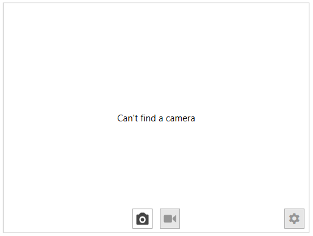
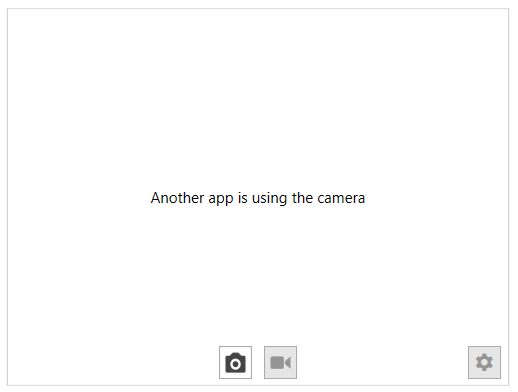

# Unavailable Camera Content

The camera control cannot connect a camera if it is already used by another application. In this case and алсо when there is no camera you can show a custom messages. 

To show a message when there is no camera connected, set the __NoCameraContent__ property. Additionally, you can use the __NoCameraContentTemplate__ property.

#### __[XAML] Example 1: Setting NoCamerContent__
{{region radwebcam-features-no-camera-content-0}}
	<telerik:RadWebCam>
		<telerik:RadWebCam.NoCameraContent>
			<TextBlock VerticalAlignment="Center" TextAlignment="Center" Text="Can't find a camera" />
		</telerik:RadWebCam.NoCameraContent>
	</telerik:RadWebCam>
{{endregion}}

#### __[XAML] Example 2: Setting NoCamerContent and NoCameraContentTemplate__
{{region radwebcam-features-no-camera-content-1}}
	<telerik:RadWebCam NoCameraContent="Can't find a camera">
		<telerik:RadWebCam.NoCameraContentTemplate>
			<DataTemplate>
				<TextBlock VerticalAlignment="Center" TextAlignment="Center" Text="{Binding}" />
			</DataTemplate>
		</telerik:RadWebCam.NoCameraContent>
	</telerik:RadWebCam>
{{endregion}}

#### Figure 1: No Camera Content

To show a message when another application is using the camera, set the __CameraBusyContent__ property. Additionally, you can use the __CameraBusyContentTemplate__ property.

#### __[XAML] Example 3: Setting CameraBusyContent__
{{region radwebcam-features-no-camera-content-2}}
	<telerik:RadWebCam>
		<telerik:RadWebCam.CameraBusyContent>
			<TextBlock VerticalAlignment="Center" TextAlignment="Center" Text="Another app is using the camera" />
		</telerik:RadWebCam.CameraBusyContent>
	</telerik:RadWebCam>
{{endregion}}

#### __[XAML] Example 4: Setting CameraBusyContent and CameraBusyContentTemplate__
{{region radwebcam-features-no-camera-content-3}}
	<telerik:RadWebCam CameraBusyContent="Another app is using the camera">
		<telerik:RadWebCam.CameraBusyContentTemplate>
			<DataTemplate>
				<TextBlock VerticalAlignment="Center" TextAlignment="Center" Text="{Binding}" />
			</DataTemplate>
		</telerik:RadWebCam.CameraBusyContent>
	</telerik:RadWebCam>
{{endregion}}

#### Figure 2: Busy Camera Content

## See Also  
* [Getting Started]()
* [SnapshotTaken]()
* [Recording Video]()
