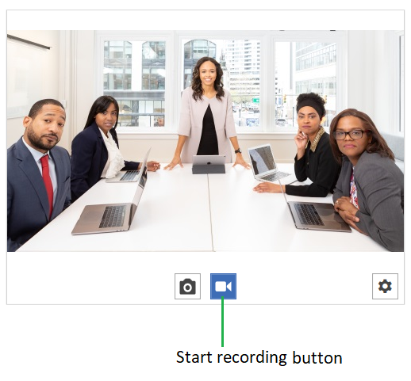

# Recording Video

To start recording a video you can press the "Start recording" button or call the `StartRecording` method of the `RadWebCam` control. 



To enable video recording set the `RecordingFilePath` property of the control. This is the path to the video where the recording will be stored.

__Set the recording file path in XAML__
```XAML
	<telerik:RadWebCam RecordingFilePath="C:\\temp\\video.mp4"/>
```

__Set the recording file path in code__
```C#
	string videoFileName = Path.Combine(Environment.GetFolderPath(Environment.SpecialFolder.Desktop), "video.mp4");
	
	// If there is no "video.mp4" file, such file will get created. If the file exists, it will get overridden.
	radWebCam.RecordingFilePath = videoFileName
	
	radWebCam.StartRecording();
```

To stop recording, press the "Stop" button or call the `StopRecording` method of RadWebCam. This will stop the recording and close the file stream.

__Stop capturing a video__
```C#
	radWebCam.StopRecording();
```

You can indicate that the camera control is recording via its `IsRecording` property.

> Setting the `IsRecording` property of RadWebCam will also start or stop the recording.

## Elapsed Time Format

The control allows you to replace the default elapsed date-time format. To do this, set the `VideoRecordingElapsedTimeFormat` property of the RadWebCam control.

__Elapsed time default format__


__Set VideoRecordingElapsedTimeFormat in XAML__
```XAML
	<telerik:RadWebCam VideoRecordingElapsedTimeFormat="ss" />
```

__Set VideoRecordingElapsedTimeFormat in code__
```C#
	this.radWebCam.VideoRecordingElapsedTimeFormat = "ss";
```

__Elapsed time custom format__


## See Also  
* [Getting Started]()
* [Commands]()
* [Events]()