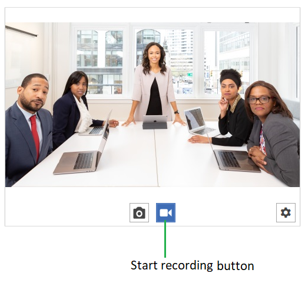

# Recording Video

To start recording a video you can press the "Start recording" button or call the `StartRecording` method of the `RadWebCam` control. 

To enable video recording set the `RecordingFilePath` property of the control. This is the path to the video where the recording will be stored.

__Set the recording file path in XAML__
<snippet id='radwebcam-features-recording-video-block_1-xaml' />

__Set the recording file path in code__
<snippet id='radwebcam-features-recording-video-block_2-cs' />

To stop recording, press the "Stop" button or call the `StopRecording` method of RadWebCam. This will stop the recording and close the file stream.

__Stop capturing a video__
<snippet id='radwebcam-features-recording-video-block_3-cs' />

You can indicate that the camera control is recording via its `IsRecording` property.

> Setting the `IsRecording` property of RadWebCam will also start or stop the recording.

## Elapsed Time Format

The control allows you to replace the default elapsed date-time format. To do this, set the `VideoRecordingElapsedTimeFormat` property of the RadWebCam control.

__Elapsed time default format__

__Set VideoRecordingElapsedTimeFormat in XAML__
<snippet id='radwebcam-features-recording-video-block_4-xaml' />

__Set VideoRecordingElapsedTimeFormat in code__
<snippet id='radwebcam-features-recording-video-block_5-cs' />

__Elapsed time custom format__

## See Also  
* [Getting Started]()
* [Commands]()
* [Events]()