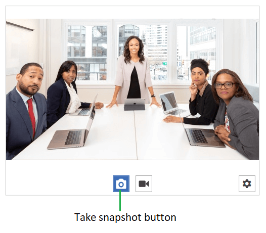

# Snapshots

The `RadWebCam` control allows you to snapshot the currently displayed video feed.

This can be done via the "Take snapshot" button of the control, or the `TakeSnapshot` method. When the snapshot is saved the `SnapshotTaken` event is raised, where you can get the `BitmapSource` object with the assocaited frame's image.

When the `PreviewSnapshots` property is `true` the `SnapshotTaken` event is raised only after the snapshot is saved. When the property is `false`, the event is raised immediately after you click on the "Take snapshot" button, or after you call the `TakeSnapshot` method.

__Take snapshot button__



__Taking a snapshot in code__
```XAML
	public MainWindow()
	{
		InitializeComponent();		
		this.radWebCam.SnapshotTaken += RadWebCam_SnapshotTaken;
	}
	
	public void OnTakeSnapshot()
	{
		this.radWebCam.TakeSnapshot();
	}

	private void RadWebCam_SnapshotTaken(object sender, SnapshotTakenEventArgs e)
	{
		BitmapSource snapshot = e.Snapshot;
		// here you save the source to a file, in memory, or to show it in the UI
	}
```

__Taking a snapshot in code__
```VB.NET
	Public Sub New()
        InitializeComponent()
        Me.radWebCam.SnapshotTaken += AddressOf RadWebCam_SnapshotTaken
    End Sub

    Public Sub OnTakeSnapshot()
        Me.radWebCam.TakeSnapshot()
    End Sub

    Private Sub RadWebCam_SnapshotTaken(ByVal sender As Object, ByVal e As SnapshotTakenEventArgs)
        Dim snapshot As BitmapSource = e.Snapshot
		' here you save the source to a file, in memory, or to show it in the UI
    End Sub
```

To discard the snapshot preview, call the `DiscardSnapshot` method of RadWebCam. The method works only when a snapshot is taken and is currently being previewed.

Additionally, there is a `SaveSnapshot` method which fires the `SnapshotTaken` event. The method works only when a snapshot is taken and is currently being previewed.

## Preview Snapshots

By default when you take a snapshot a preview of the image will be shown. To disable this, set the `PreviewSnapshots` property to `False`.

__Disable snapshots preview in XAML__
```XAML
	<telerik:RadWebCam PreviewSnapshots="False" />
```

__Disable snapshots preview in code__
```C#
	this.radWebCam.PreviewSnapshots = false;
```
```VB.NET
	Me.radWebCam.PreviewSnapshots = False
```

You can indicate if the snapshot preview is displayed via the `IsPreviewingSnapshot` property of RadWebCam.

## See Also  
* [Getting Started]()
* [Commands]()
* [Save Snapshot to File]()
