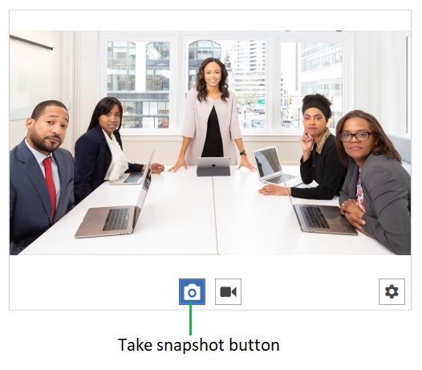

# Save snapshot to File

This article shows how to take and save a snapshot to a file.

## Setting up the Control

Add the control in the logical tree of the view and subscribe to the __SnapshotTaken__ event.

#### __[XAML] Example 1: Defining RadWebCam__
{{region radwebcam-save-snapshot-to-file-0}}
	<telerik:RadWebCam x:Name="radWebCam" SnapshotTaken="RadWebCam_SnapshotTaken"/>
{{endregion}}

In the event handler you get access to a BitmapSource object holding the snapshot. You can use this to save it to the file system. 

This example shows how to open a file dialog and save it.

#### __[C#] Example 2: Save the snapshot__
{{region radwebcam-save-snapshot-to-file-1}}
	private void RadWebCam_SnapshotTaken(object sender, SnapshotTakenEventArgs e)
	{
		BitmapSource snapshot = e.Snapshot;
		// add saving logic here.
	}
{{endregion}}

## Taking Snapshot

To take the snapshot press the "Take snapshot" button. Or call the __TakeSnapshot__ method. This will fire the __SnapshotTaken__ event.

> By default a preview of the snapshot will be shown that allows you to choose if it should be saved or not. If you choose to save it the SnapshotTaken event will fire. To disable the preview set the __IsPreviewingSnapshot__ property of RadWebCam to False.

#### Figure 1: Take snapshot button

#### __[C#] Example 3: __
{{region radwebcam-save-snapshot-to-file-2}}
	this.radWebCam.TakeSnapshot();
{{endregion}}

## See Also