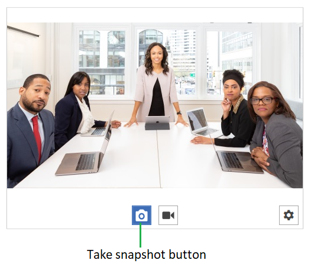

# Save Snapshot to File

This article shows how to take and save a snapshot to a file.

## Setting up the Control

Add the control to the logical tree of the view and subscribe to the `SnapshotTaken` event.

__Defining RadWebCam__
<snippet id='radwebcam-how-to-save-snapshot-to-file-block_1-xaml' />

In the event handler you get access to a `BitmapSource` object holding the snapshot. You can use this to save it to the file system. 

__Opening a file dialog in the SnapshotTaken event handler and saving it to a file__
<snippet id='radwebcam-how-to-save-snapshot-to-file-block_2-cs' />

## Taking Snapshot

To take the snapshot press the "Take snapshot" button. Or call the `TakeSnapshot` method. This will fire the `SnapshotTaken` event.

> By default a preview of the snapshot will be shown that allows you to choose if it should be saved or not. If you choose to save it the SnapshotTaken event will fire. To disable the preview set the `IsPreviewingSnapshot` property of RadWebCam to `False`.

__Take snapshot button__

__Take Snapshot__
<snippet id='radwebcam-how-to-save-snapshot-to-file-block_3-cs' />

## See Also  
* [Getting Started]()
* [SnapshotTaken]()
* [Commands]()