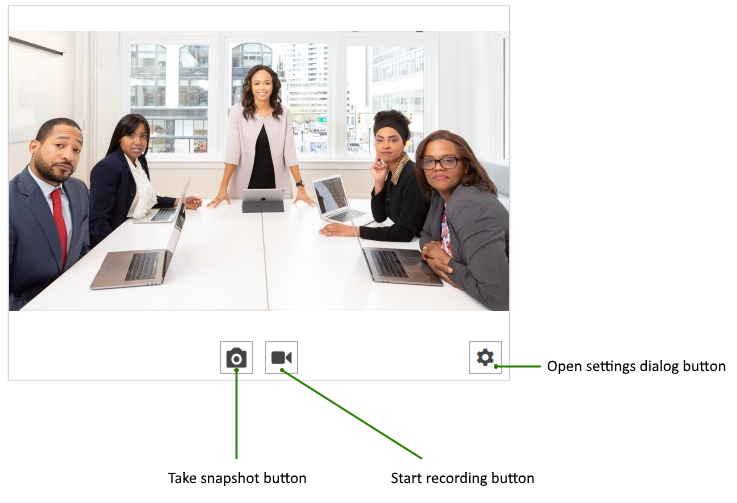
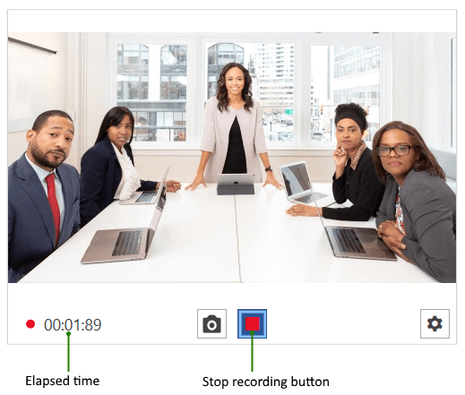
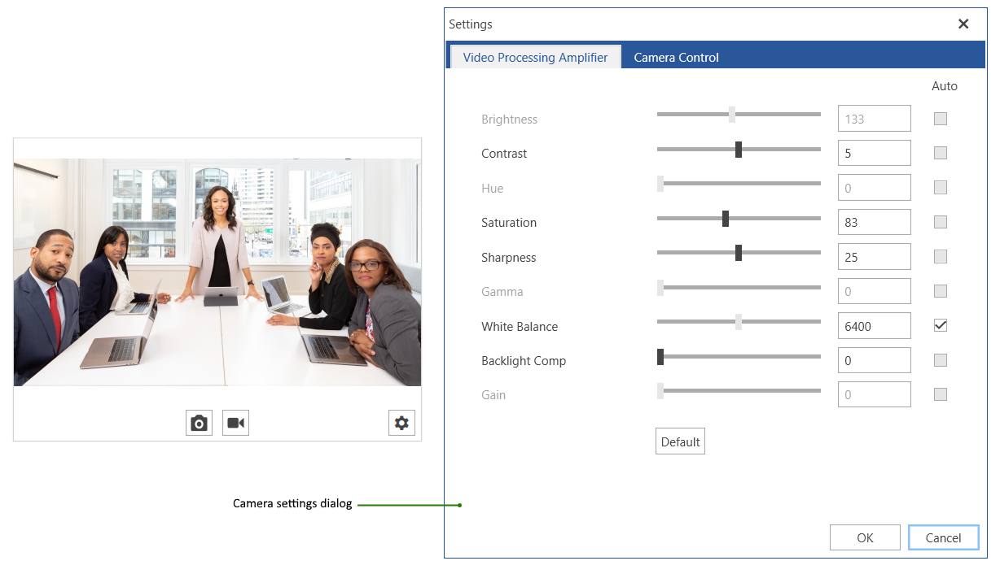

# Visual Structure

This article shows the main UI structure of the RadWebCam control.

#### Figure 1: RadWebCam - Initial State

#### Figure 2: RadWebCam - Recording State

#### Figure 3: RadWebCam - Settings Dialog

## See Also
* [Getting Started]()
* [SnapshotTaken]()
* [Recording Video]()

