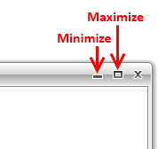
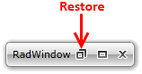
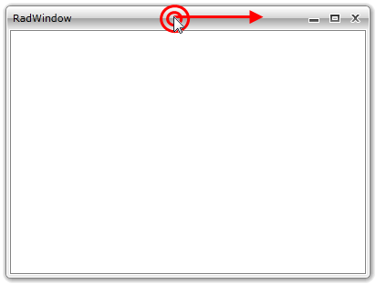
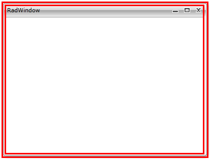

# End-User Capabilities

The user is capable of doing the following actions via the UI provided by the __RadWindow__:

## Minimize/Maximize

The user can maximize or minimize the __RadWindow__ by using the __Minimize__ and __Maximize__ buttons at the top-right corner of the window.

## Restore

When minimized or maximized the __RadWindow__ can be restored by using the Restore button at the top-right corner.

## Close

The user can close the __RadWindow__ by using the Close button at the top-right corner.

## Move

The user can move the window by clicking on the __RadWindow__'s header and then drag it around the screen.

## Resize

The user can resize the __RadWindow__ in different directions by clicking and dragging the __RadWindow__'s border.

## See Also

 * [Visual Structure]()

 * [Getting Started]()

 * [Use Keyboard to Get User Response]()
