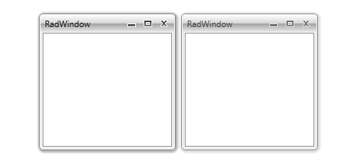

# Active State Visualization Mode

As of __R3 2017 SP 1__ you can use the __ShouldUpdateActiveState__ property to control whether there is a visual difference between an active and an inactive __RadWindow__. 

When set to **True** while the RadWindow is displayed as a [modal dialog window]() it will add a blinking effect for the RadWindow when its owner is clicked. 

> The default value is **True**. If set to **False** the __RadWindow__ will always appear visually active.

#### Figure 1: Active and inactive RadWindow in the Office_Black theme

## See Also

* [Getting Started]()
* [Working with RadWindow]()
* [Modal Windows]()