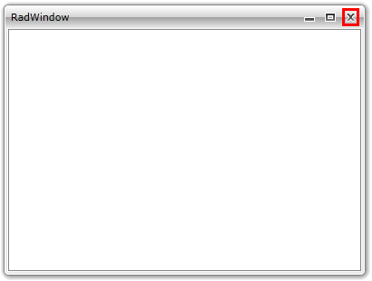
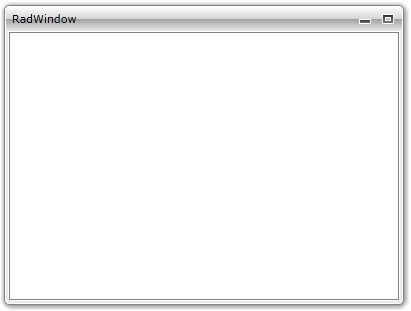

# Closing

The __RadWindow__ can be closed by either clicking on its 'Close' button at the top-right corner or by calling the __Close()__ method of the __RadWindow__ instance.

#### __C#__

{{region radwindow-features-closing_0}}
	RadWindow radWindow = new RadWindow();
	radWindow.Show();
	...
	radWindow.Close();
{{endregion}}

#### __VB.NET__

{{region radwindow-features-closing_1}}
	Dim radWindow As New RadWindow()
	radWindow.Show()
	...
	radWindow.Close()
{{endregion}}

>tipWhen the __RadWindow__ gets closed the __Closed__ event is raised. More about events can be found [here]().

To disable the closing of the __RadWindow__ via the UI you have to set the __CanClose__ property to __False__.

>The only scenario, where you can add content to the __RadWindow__ at design-time, is when the __RadWindow__ represents an entire user control. To learn more about that read [here]().

#### __C#__

{{region radwindow-features-closing_2}}
	RadWindow radWindow = new RadWindow();
	radWindow.CanClose = false;
{{endregion}}

#### __VB.NET__

{{region radwindow-features-closing_3}}
	Dim radWindow As New RadWindow()
	radWindow.CanClose = False
{{endregion}}

# See Also

 * [Moving]()

 * [Minimizing/Maximizing]()

 * [Resizing]()
