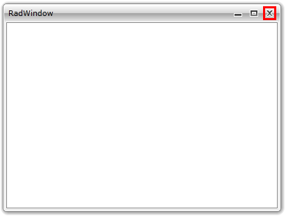
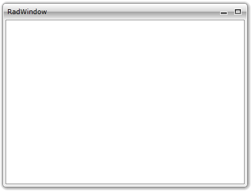

# Closing

The __RadWindow__ can be closed by either clicking on its 'Close' button at the top-right corner or by calling the __Close()__ method of the __RadWindow__ instance.

__Example 1: Closing a RadWindow__

<snippet id='radwindow-features-closing-block_1-cs' />
<snippet id='radwindow-features-closing-block_2-vb' />

>tip When the __RadWindow__ gets closed, the __Closed__ event is raised. More about events can be found [here]().

## Prevent Closing

To disable the closing of the __RadWindow__ via the UI you can set the __CanClose__ property to __False__.

__Example 2: Setting the CanClose property__

<snippet id='radwindow-features-closing-block_3-cs' />
<snippet id='radwindow-features-closing-block_4-vb' />

Alternatively, you can also handle the __PreviewClosed__ event and set the __Cancel__ property of the event arguments to True. 

__Example 3: Canceling the PreviewClosed event__

<snippet id='radwindow-features-closing-block_5-cs' />
<snippet id='radwindow-features-closing-block_6-vb' />

## See Also

 * [Moving]()

 * [Minimizing/Maximizing]()

 * [Resizing]()