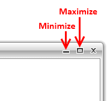
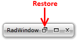

# Minimizing/Maximizing

The __RadWindow__ can be minimized or maximized via the buttons in its top-right corner.

#### __Figure 1: RadWindow Minimize and Maximize Buttons__

After being minimized or maximized the respective button is replaced by a __Restore__ button. By clicking on this button the user can bring the __RadWindow__ in its __Normal__ state.

#### __Figure 2: RadWindow Restore Button__

>tip Every time when the __RadWindow__ gets minimized or maximized, it changes its state. More about the __RadWindow__ states can be found [here]().

>tip The __RestoreMinimizedLocation__ property allows the __RadWindow__ to store its size and position for the __Normal__ and the __Minimized__ states.

## See Also

 * [Hide the Maximize and Minimize buttons]()

 * [Resizing]()

 * [Closing]()

 * [Moving]()
