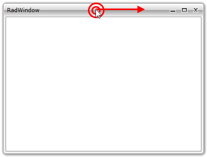

# Moving

The user can move the window by clicking on the __RadWindow__'s header and then drag it around the screen.



>tipWhen the __RadWindow__ gets moved, the __LayoutChangeStarted__ and the __LayoutChangeEnded__ events are raised. More about the events can be found [here]().

To disable the moving of the __RadWindow__ via the UI you have to set the __CanMove__ property to __False__.


```C#
	RadWindow radWindow = new RadWindow();
	radWindow.CanMove = false;
```
```VB.NET
	Dim radWindow As New RadWindow()
	radWindow.CanMove = False
```

## See Also

 * [Closing]()

 * [Resizing]()

 * [Minimizing/Maximizing]()

 * [Prevent Dragging Off the Screen]()
