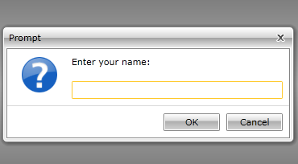
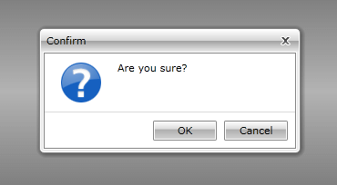

# Predefined Dialogs

The __RadWindow__ provides you with a set of predefined dialog windows that are an easy way to handle a few scenarios:

* Alert the user with a certain message

* Prompt the user for a certain information

* Allow the user to confirm an action

These windows can be shown using the respective methods of the static __RadWindow__ class:

* __Alert()__ - 3 overloads

* __Prompt()__ - 3 overloads

* __Confirm()__ - 2 overloads

>All of the predefined windows are modal!

Each of the methods has an overload that takes an object of type __DialogParameters__ as an argument. The __DialogParameters__ class has members similar to the specific ones of the __RadWindow__. This allows you to configure the predefined dialogs via the argument of the method.

Here is a list of the __DialogParameters__ class members:

* __CancelButtonContent__

* __Closed__

* __Content__

* __ContentStyle__

* __DefaultPromptResultValue__

* __Header__

* __IconContent__

* __ModalBackground__

* __OkButtonContent__

* __Opened__

* __Owner__

* __Theme__

* __WindowStyle__

For more info about the class read
        [here](http://www.telerik.com/help/silverlight/allmembers_t_telerik_windows_controls_dialogparameters.html)[here](http://www.telerik.com/help/wpf/allmembers_t_telerik_windows_controls_dialogparameters.html)
     .

## Alert

The alert dialog window allows you to alert the user with a certain message. It is shown by calling the __Alert()__ method of the static __RadWindow__ class. It can take one of the following argument groups:

* __DialogParameters dialogParameters__ - an object of type __DialogParameters__.

#### __C#__

{{region radwindow-features-predefined-dialogs_0}}
	RadWindow.Alert( new DialogParameters()
	{
	    Content = "Hello"
	} );
	{{endregion}}

#### __VB.NET__

{{region radwindow-features-predefined-dialogs_1}}
	Dim parameters As New DialogParameters()
	parameters.Content = "Hello"
	RadWindow.Alert(parameters)
	{{endregion}}

* __object content__ - an object that represents the content.

#### __C#__

{{region radwindow-features-predefined-dialogs_2}}
	RadWindow.Alert( "Hello" );
	{{endregion}}

#### __VB.NET__

{{region radwindow-features-predefined-dialogs_3}}
	RadWindow.Alert( "Hello" )
	{{endregion}}

* __object content, EventHandler<WindowsClosedEventArgs> closed__ - an object, that represents the content and an event handler that should handle the __Closed__ event of the __RadWindow__.

#### __C#__

{{region radwindow-features-predefined-dialogs_4}}
	public void ShowAlert()
	{
	    RadWindow.Alert( "Hello", this.OnClosed );
	}
	private void OnClosed( object sender, WindowClosedEventArgs e )
	{
	}
	{{endregion}}

#### __VB.NET__

{{region radwindow-features-predefined-dialogs_5}}
	Public Sub ShowAlert()
			RadWindow.Alert("Hello", AddressOf Me.OnClosed)
	End Sub
	Private Sub OnClosed(sender As Object, e As WindowClosedEventArgs)
	End Sub
	{{endregion}}

         
      

## Prompt

The prompt dialog window allows the user to input information. It is shown by calling the __Prompt()__ method of the static __RadWindow__ class. It can take one of the following argument groups:

* __DialogParameters dialogParameters__ - an object of type __DialogParameters__.

#### __C#__

{{region radwindow-features-predefined-dialogs_6}}
	DialogParameters parameters = new DialogParameters();
	parameters.Content = "Enter your name:";
	RadWindow.Prompt( parameters );
	{{endregion}}

#### __VB.NET__

{{region radwindow-features-predefined-dialogs_7}}
	Dim parameters As New DialogParameters()
	parameters.Content = "Enter your name:"
	RadWindow.Prompt(parameters)
	{{endregion}}

* __object content, EventHandler<WindowsClosedEventArgs> closed__ - an object that represents the content and an event handler that should handle the __Closed__ event of the __RadWindow__.

#### __C#__

{{region radwindow-features-predefined-dialogs_8}}
	public void ShowPrompt()
	{
	    RadWindow.Prompt( "Enter your name:", this.OnClosed );
	}
	private void OnClosed( object sender, WindowClosedEventArgs e )
	{
	}
	{{endregion}}

#### __VB.NET__

{{region radwindow-features-predefined-dialogs_9}}
	Public Sub ShowPrompt()
			RadWindow.Prompt("Enter your name:", AddressOf Me.OnClosed)
	End Sub
	Private Sub OnClosed(sender As Object, e As WindowClosedEventArgs)
	End Sub
	{{endregion}}

* __object content, EventHandler<WindowsClosedEventArgs> closed, string defaultPropmptResult__ - an object that represents the content, an event handler that should handle the __Closed__ event of the __RadWindow__and a default result value.

#### __C#__

{{region radwindow-features-predefined-dialogs_10}}
	public void SHowPrompt()
	{
	    RadWindow.Prompt( "Enter your name:", this.OnClosed, "John Doe" );
	}
	private void OnClosed( object sender, WindowClosedEventArgs e )
	{
	}
	{{endregion}}

#### __VB.NET__

{{region radwindow-features-predefined-dialogs_11}}
	Public Sub SHowPrompt()
			RadWindow.Prompt("Enter your name:", AddressOf Me.OnClosed, "John Doe")
	End Sub
	Private Sub OnClosed(sender As Object, e As WindowClosedEventArgs)
	End Sub
	{{endregion}}

         
      

## Confirm 

The confirm dialog window allows the user to confirm an action. It is shown by calling the __Confirm()__ method of the static __RadWindow__ class. It can take one of the following argument groups:

* __DialogParameters dialogParameters__ - an object of type __DialogParameters__.

#### __C#__

{{region radwindow-features-predefined-dialogs_12}}
	DialogParameters parameters = new DialogParameters();
	parameters.Content = "Are you sure?";
	RadWindow.Confirm( parameters );
	{{endregion}}

#### __VB.NET__

{{region radwindow-features-predefined-dialogs_13}}
	Dim parameters As New DialogParameters()
	parameters.Content = "Are you sure?"
	RadWindow.Confirm(parameters)
	{{endregion}}

* __object content, EventHandler<WindowsClosedEventArgs> closed__ - an object that represents the content and an event handler that should handle the __Closed__ event of the __RadWindow__.

#### __C#__

{{region radwindow-features-predefined-dialogs_14}}
	public void ShowConfirm()
	{
	    RadWindow.Confirm( "Are you sure?", this.OnClosed );
	}
	private void OnClosed( object sender, WindowClosedEventArgs e )
	{
	}
	{{endregion}}

#### __VB.NET__

{{region radwindow-features-predefined-dialogs_15}}
	Public Sub ShowConfirm()
			RadWindow.Confirm("Are you sure?", AddressOf Me.OnClosed)
	End Sub
	Private Sub OnClosed(sender As Object, e As WindowClosedEventArgs)
	End Sub
	{{endregion}}

         
      

## Styling the predefined windows

If you want to change the appearance of the predefined window, you have to show it by calling the overload that takes a __DialogParameters__ object as an argument. Create an appropriate style and set it to its __WindowStyle__ property. To learn more read [here]().

# See Also

 * [Working with RadWindow]()

 * [Styling the Predefined Windows]()

 * [RadWindowManager]()
