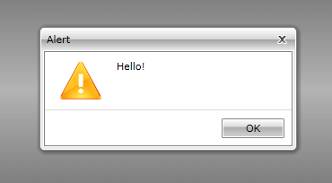
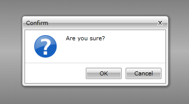
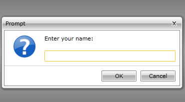

# Predefined Dialogs

The __RadWindow__ provides you with a set of predefined dialog windows that are an easy way to handle a few scenarios:

* Alert the user with a certain message

* Prompt the user for certain information

* Allow the user to confirm an action

These windows can be shown using the respective static methods of the __RadWindow__ class:

* __Alert()__ - 3 overloads

* __Confirm()__ - 2 overloads

* __Prompt()__ - 3 overloads

>All of the predefined windows are modal.

Each of the methods has an overload that takes an object of type __DialogParameters__ as an argument. The __DialogParameters__ class has members similar to the specific ones of the __RadWindow__. This allows you to configure the predefined dialogs via the argument of the method.

Here is a list of the __DialogParameters__ class members:

* __CancelButtonContent__

* __Closed__

* __Content__

* __ContentStyle__

* __DefaultPromptResultValue__

* __Header__

* __IconContent__

* __ModalBackground__

* __OkButtonContent__

* __Opened__

* __Owner__

* __Theme__

* __WindowStyle__



* __DefaultFocusedButton__



For more info about the class read [here](https://docs.telerik.com/devtools/silverlight/api/telerik.windows.controls.dialogparameters)[here](https://docs.telerik.com/devtools/wpf/api/telerik.windows.controls.dialogparameters).

## Alert

The alert dialog window allows you to alert the user with a certain message. It is shown by calling the __Alert()__ method of the static __RadWindow__ class. It can take one of the following argument groups:

* __DialogParameters dialogParameters__ - an object of type __DialogParameters__.

__Example 1: Showing RadAlert with DialogParameters__

<snippet id='radwindow-features-predefined-dialogs-block_1-cs' />
<snippet id='radwindow-features-predefined-dialogs-block_2-vb' />

* __object content__ - an object that represents the content.

__Example 2: Showing RadAlert without DialogParameters__

<snippet id='radwindow-features-predefined-dialogs-block_3-cs' />
<snippet id='radwindow-features-predefined-dialogs-block_4-vb' />

* __object content, EventHandler\<WindowsClosedEventArgs\> closed__ - an object, that represents the content and an event handler that should handle the __Closed__ event of the __RadWindow__.

__Example 3: Handling RadAlert's Closed event__

<snippet id='radwindow-features-predefined-dialogs-block_5-cs' />
<snippet id='radwindow-features-predefined-dialogs-block_6-vb' />

>The **DialogResult** of the WindowClosedEventArgs will be **True** if the user has pressed **OK** and **null** if the user clicked the **close button** of the window. The **PromptResult** property will always be **null**.

## Confirm 

The confirm dialog window allows the user to confirm an action. It is shown by calling the __Confirm()__ method of the static __RadWindow__ class. It can take one of the following argument groups:

* __DialogParameters dialogParameters__ - an object of type __DialogParameters__.

__Example 4: Showing RadConfirm__

<snippet id='radwindow-features-predefined-dialogs-block_7-cs' />
<snippet id='radwindow-features-predefined-dialogs-block_8-vb' />

* __object content, EventHandler\<WindowsClosedEventArgs\> closed__ - an object that represents the content and an event handler that should handle the __Closed__ event of the __RadWindow__.

__Example 5: Handling RadConfirm's Closed event__

<snippet id='radwindow-features-predefined-dialogs-block_9-cs' />
<snippet id='radwindow-features-predefined-dialogs-block_10-vb' />

>The **DialogResult** of the WindowClosedEventArgs will be **True** if the user has pressed **OK**, **False** if the user clicked **Cancel** and **null** if the user clicked the **close button** of the window. The **PromptResult** property will always be **null**.

## Prompt

The prompt dialog window allows the user to input information. It is shown by calling the __Prompt()__ method of the static __RadWindow__ class. It can take one of the following argument groups:

* __DialogParameters dialogParameters__ - an object of type __DialogParameters__.

__Example 6: Showing RadPrompt__

<snippet id='radwindow-features-predefined-dialogs-block_11-cs' />
<snippet id='radwindow-features-predefined-dialogs-block_12-vb' />

* __object content, EventHandler\<WindowsClosedEventArgs\> closed__ - an object that represents the content and an event handler that should handle the __Closed__ event of the __RadWindow__.

__Example 7: Handling RadPrompt's Closed event__

<snippet id='radwindow-features-predefined-dialogs-block_13-cs' />
<snippet id='radwindow-features-predefined-dialogs-block_14-vb' />

* __object content, EventHandler\<WindowsClosedEventArgs\> closed, string defaultPropmptResult__ - an object that represents the content, an event handler that should handle the __Closed__ event of the __RadWindow__ and a default result value.

__Example 8: Showing RadPrompt with a default result__

<snippet id='radwindow-features-predefined-dialogs-block_15-cs' />
<snippet id='radwindow-features-predefined-dialogs-block_16-vb' />

>The **DialogResult** of the WindowClosedEventArgs will be **True** if the user has pressed **OK**, **False** if the user clicked **Cancel** and **null** if the user clicked the **close button** of the window. The **PromptResult** property will hold the value entered by the user if they clicked **OK** and **null** otherwise.

## Styling the Predefined Windows

If you want to change the appearance of the predefined window, you have to show it by calling the overload that takes a __DialogParameters__ object as an argument. Create an appropriate style and set it to its __WindowStyle__ property. To learn more read [here]().



## Setting the Default Focused Button

Since the __2019.1.415__ internal build version and the __R2 2019__ official release, the DialogParameters expose a __DefaultFocusedButton__ property. It allows you to set the button that will be focused by default when the modal window is shown. This property is of type [ResponseButton](https://docs.telerik.com/devtools/wpf/api/telerik.windows.controls.responsebutton).

__Example 9: Setting the default focused button of a RadConfirm to Cancel__

<snippet id='radwindow-features-predefined-dialogs-block_17-cs' />
<snippet id='radwindow-features-predefined-dialogs-block_18-vb' />



## See Also

 * [Working with RadWindow]()

 * [Styling the Predefined Windows]()

 * [RadWindowManager]()