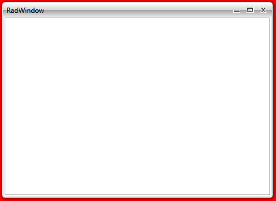
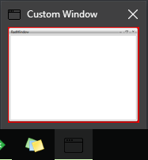

# RadWindowInteropHelper

The **RadWindowInteropHelper** helper class assists for the interoperation between **Windows Presentation Foundation** (WPF) and **Win32** code.

Here is a brief list of all attached properties exposed by the class:

* **ClipMaskCornerRadius**: The **CornerRadius** used to create a clipping mask on the underlying Window.
* **AllowTransparency**: Gets or sets the **AllowTransparency** property of the underlying Window.
* **OpaqueWindowBackground**: The **Brush** used to render the Background of the underlying window if **AllowTransparency** is set to **False**.
* **Title**: Gets or sets the **Title** used to display in the OS for the underlying Window.
* **Icon**: Gets or sets the **ImageSource** used to display the Icon in the OS for the underlying Window.
* **ShowInTaskbar**: Gets or sets the **ShowInTaskbar** property of the underlying Window.

**Example 1** demonstrates how to set each of the properties both in XAML and code-behind while **Figure 1**  and **Figure 2** illustrate the final result.

__Example 1: Set RadWindowInteropHelper attached properties__

```XAML
	<telerik:RadWindow x:Class="ProjectNamespace.CustomWindow"
        xmlns="http://schemas.microsoft.com/winfx/2006/xaml/presentation"
        xmlns:x="http://schemas.microsoft.com/winfx/2006/xaml"
        xmlns:telerik="http://schemas.telerik.com/2008/xaml/presentation"
		xmlns:navigation="clr-namespace:Telerik.Windows.Controls.Navigation;assembly=Telerik.Windows.Controls.Navigation" 
		navigation:RadWindowInteropHelper.ClipMaskCornerRadius="0"
		navigation:RadWindowInteropHelper.AllowTransparency="False"
		navigation:RadWindowInteropHelper.OpaqueWindowBackground="Red"
		navigation:RadWindowInteropHelper.Title="Custom Window"
		navigation:RadWindowInteropHelper.Icon="icon.png"
		navigation:RadWindowInteropHelper.ShowInTaskbar="True" >
	    <Grid>
		<!-- ... -->
	    </Grid>
	</telerik:RadWindow>
```

__Example 1: Set RadWindowInteropHelper attached properties__

```C#
	RadWindowInteropHelper.SetClipMaskCornerRadius(this, new CornerRadius(0));
	RadWindowInteropHelper.SetAllowTransparency(this, false);
	RadWindowInteropHelper.SetOpaqueWindowBackground(this, Brushes.Red);
	RadWindowInteropHelper.SetTitle(this, "Custom Window");
	RadWindowInteropHelper.SetIcon(this, new BitmapImage(new Uri("../../icon.png", UriKind.RelativeOrAbsolute)));
	RadWindowInteropHelper.SetShowInTaskbar(this, true);
```
```VB.NET
	RadWindowInteropHelper.SetClipMaskCornerRadius(Me, New CornerRadius(0))
	RadWindowInteropHelper.SetAllowTransparency(Me, False)
	RadWindowInteropHelper.SetOpaqueWindowBackground(Me, Brushes.Red)
	RadWindowInteropHelper.SetTitle(Me, "Custom Window")
	RadWindowInteropHelper.SetIcon(Me, New BitmapImage(New Uri("../../icon.png", UriKind.RelativeOrAbsolute)))
	RadWindowInteropHelper.SetShowInTaskbar(Me, True)
```

#### __Figure 1: The customized RadWindow__



#### __Figure 1: The customized RadWindow's taskbar thumbnail preview__



## See Also

 * [Working with RadWindow]()

 * [Predefined Dialogs]()

 * [States]()
