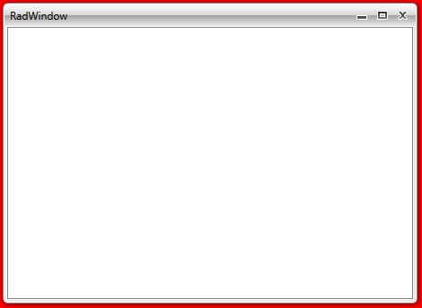
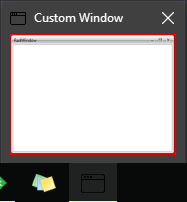

# RadWindowInteropHelper

The **RadWindowInteropHelper** helper class assists for the interoperation between **Windows Presentation Foundation** (WPF) and **Win32** code.

Here is a brief list of all attached properties exposed by the class:

* **ClipMaskCornerRadius**: The **CornerRadius** used to create a clipping mask on the underlying Window.
* **AllowTransparency**: Gets or sets the **AllowTransparency** property of the underlying Window.
* **OpaqueWindowBackground**: The **Brush** used to render the Background of the underlying window if **AllowTransparency** is set to **False**.
* **Title**: Gets or sets the **Title** used to display in the OS for the underlying Window.
* **Icon**: Gets or sets the **ImageSource** used to display the Icon in the OS for the underlying Window.
* **ShowInTaskbar**: Gets or sets the **ShowInTaskbar** property of the underlying Window.

**Example 1** demonstrates how to set each of the properties both in XAML and code-behind while **Figure 1**  and **Figure 2** illustrate the final result.

__Example 1: Set RadWindowInteropHelper attached properties__

<snippet id='radwindow-features-radwindowinterophelper-block_1-xaml' />

__Example 1: Set RadWindowInteropHelper attached properties__

<snippet id='radwindow-features-radwindowinterophelper-block_2-cs' />
<snippet id='radwindow-features-radwindowinterophelper-block_3-vb' />

#### __Figure 1: The customized RadWindow__

#### __Figure 1: The customized RadWindow's taskbar thumbnail preview__

## Hiding RadWindow from the Task Switcher

By default, `RadWindow` appears in the Windows Task Switcher (`Alt+Tab` menu). To hide it from the Task Switcher, create a custom class that derives from `RadWindow` and override the `ShouldShowInTaskSwitcher` virtual method to return `false`.

>important For the Task Switcher hiding to work correctly, the `ShowInTaskbar` property of the underlying window must also be set to `False`. Use the `RadWindowInteropHelper.ShowInTaskbar` attached property to control this behavior.

__Example 2: Create a custom RadWindow class that is hidden from the Task Switcher__

<snippet id='radwindow-features-radwindowinterophelper-block_4-cs' />
<snippet id='radwindow-features-radwindowinterophelper-block_5-vb' />

The `ShouldShowInTaskSwitcher` method is called when the window is shown. Returning `false` prevents the window from appearing in the `Alt+Tab` menu. This approach is useful for widget-style applications where the window acts as a small, hideable overlay that does not need to be selectable through the Task Switcher.

## See Also

 * [Working with RadWindow]()

 * [Predefined Dialogs]()

 * [States]()