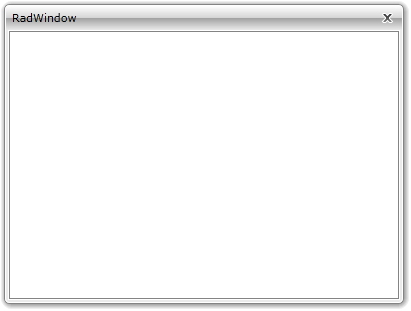

# Resizing

In order to resize the __RadWindow__ the user just have to drag its border in the desired direction. The [Minimizing and Maximizing]() are also ways of changing the __RadWindow__ size. However, you are able to restrict the user from resizing the __RadWindow__. This is done by setting the __ResizeMode__ property to one of the following values:

* __CanMinimize__: This value enables only the minimizing. The maximizing and the resizing of the __RadWindow__ are disabled.

* __CanResize__: This is the default value and it allows the __RadWindow__ to be resized, minimized and maximized.

* __CanResizeWithGrip__: This value allows the __RadWindow__ to be resized, minimized, and maximized. It also adds a grip in the bottom-right corner which can be used for resizing purposes.

* __NoResize__: This value disables the __RadWindow__ form being resized, minimized or maximized.

Here is an example of a __RadWindow__ that can be resized, minimized or maximized.

>It's not a good practice do declare your __RadWindow__ as visual element in XAML. The only scenario, when it is meaningful to use the __RadWindow__ in XAML, is when it represents the entire user control. To learn more about that read [here]().


```C#
	RadWindow radWindow = new RadWindow();
	radWindow.ResizeMode = ResizeMode.NoResize;
```


```VB.NET
	Dim radWindow As New RadWindow()
	radWindow.ResizeMode = ResizeMode.NoResize
```



## See Also

 * [Closing]()

 * [Moving]()

 * [Minimizing/Maximizing]()
