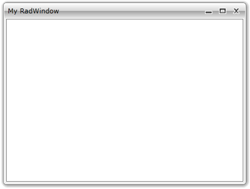

# Window Header

The __RadWindow__ allows you to display a header in the top part of it. To specify the header you can use either the __Header__ or the __HeaderTemplate__ properties.

If you have a window-specific header, use the __Header__ property.

>tipAs the __Header__ property is of type object you can set it to any control that you like. If you want to have a more complex icon content that consists of more than one control, be sure to wrap them inside a layout control and pass the layout control as content.

>It's not a good practice do declare your __RadWindow__ as visual element in XAML. The only scenario, when it is meaningful to use the __RadWindow__ in XAML, is when it represents the entire user control. To learn more about that read [here]().


```C#
	RadWindow radWindow = new RadWindow();
	radWindow.Header = "My RadWindow";
```


```VB.NET
	Dim radWindow As New RadWindow()
	radWindow.Header = "My RadWindow"
```

If you want to share a common icon layout structure for the content of multiple windows, define an appropriate __DataTemplate__ and set it to the __HeaderTemplate__ property of the __RadWindow__.


```XAML
	<UserControl.Resources>
	    <DataTemplate x:Key="WindowHeaderTemplate">
	        <TextBlock Text="My RadWindow" />
	    </DataTemplate>
	</UserControl.Resources>
```


```C#
	RadWindow radWindow = new RadWindow();
	radWindow.HeaderTemplate = this.Resources["WindowHeaderTemplate"] as DataTemplate;
```


```VB.NET
	Dim radWindow As New RadWindow()
	radWindow.HeaderTemplate = TryCast(Me.Resources("WindowHeaderTemplate"), DataTemplate)
```



## See Also

 * [Window Icon]()

 * [Minimizing/Maximizing]()

 * [Resizing]()
