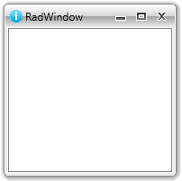

# Window Icon

`RadWindow` allows you to display a custom icon in its top-left corner. To specify the icon you can use either the `Icon` or the `IconTemplate` properties.

## Setting the Icon

You can display an icon in the RadWindow control's title bar, through its `Icon` property. This property is of type `object` and it allows you to set a value of any type.

>important `RadWindow` is declared and opened from the code behind by default. The only way to use the RadWindow as a visual element in XAML is when it represents the entire UserControl. To learn more about that read [Use RadWindow as User Control]() article.

__Setting the Icon property__

```C#
	RadWindow radWindow = new RadWindow();
	radWindow.Icon = new Image()
	{
	    Source = new BitmapImage(new Uri("../../Images/WindowIcon.png", UriKind.Relative))
	};
```
```VB.NET
	Dim radWindow As New RadWindow()
	Dim image As New Image()
	image.Source = New BitmapImage(New Uri("../../Images/WindowIcon.png", UriKind.Relative))
	radWindow.Icon = image
```

This will be the final result:



## Setting the IconTemplate

You can define a custom `DataTemplate` for the `IconTemplate` property that will be displayed as a title bar icon.

__Setting the IconTemplate property in XAML__

```XAML
	<UserControl.Resources>
	    <DataTemplate x:Key="WindowIconTemplate">
	        <Image Source="/Images/WindowIcon.png" Stretch="None" />
	    </DataTemplate>
	</UserControl.Resources>
```

__Setting the IconTemplate property in code-behind__

```C#
	RadWindow radWindow = new RadWindow();
	radWindow.IconTemplate = this.Resources["WindowIconTemplate"] as DataTemplate;
```
```VB.NET
	Dim radWindow As New RadWindow()
	radWindow.IconTemplate = TryCast(Me.Resources("WindowIconTemplate"), DataTemplate)
```

## Setting the IconMargin

You can control the margin that is applied to the chosen icon, through the `IconMargin` property of `RadWindow`.

__Setting the IconMargin property in XAML__

```XAML
	<telerik:RadWindow x:Name="radWindow" IconMargin="5 0 0 0"/>
```

__Setting the IconMargin property in code-behind__

```C#
	this.radWindow.IconMargin = new Thickness(5, 0, 0, 0);
```
```VB.NET
	Me.radWindow.IconMargin = New Thickness(5, 0, 0, 0)
```
