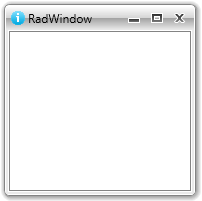

# Window Icon

`RadWindow` allows you to display a custom icon in its top-left corner. To specify the icon you can use either the `Icon` or the `IconTemplate` properties.

## Setting the Icon

You can display an icon in the RadWindow control's title bar, through its `Icon` property. This property is of type `object` and it allows you to set a value of any type.

>important `RadWindow` is declared and opened from the code behind by default. The only way to use the RadWindow as a visual element in XAML is when it represents the entire UserControl. To learn more about that read [Use RadWindow as User Control]() article.

__Setting the Icon property__

<snippet id='radwindow-features-window-icon-block_1-cs' />
<snippet id='radwindow-features-window-icon-block_2-vb' />

This will be the final result:

## Setting the IconTemplate

You can define a custom `DataTemplate` for the `IconTemplate` property that will be displayed as a title bar icon.

__Setting the IconTemplate property in XAML__

<snippet id='radwindow-features-window-icon-block_3-xaml' />

__Setting the IconTemplate property in code-behind__

<snippet id='radwindow-features-window-icon-block_4-cs' />
<snippet id='radwindow-features-window-icon-block_5-vb' />

## Setting the IconMargin

You can control the margin that is applied to the chosen icon, through the `IconMargin` property of `RadWindow`.

__Setting the IconMargin property in XAML__

<snippet id='radwindow-features-window-icon-block_6-xaml' />

__Setting the IconMargin property in code-behind__

<snippet id='radwindow-features-window-icon-block_7-cs' />
<snippet id='radwindow-features-window-icon-block_8-vb' />