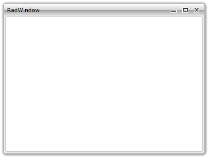
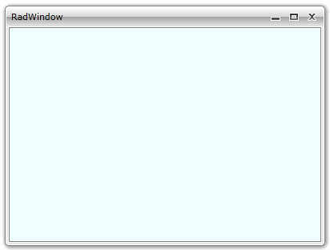

# Working with RadWindow

This topic will explain you how to work with the __RadWindow__ in details.

## Create a RadWindow

In order to use the __RadWindow__ in your application you have to add a reference to the __Telerik.Windows.Controls.Navigation__ assembly in your project.

After the reference is available, you can declare a __RadWindow__. Here is an example.


```C#
	RadWindow radWindow = new RadWindow();
	radWindow.Width = 400;
	radWindow.Height = 300;
```
```VB.NET
	Dim radWindow As New RadWindow()
	radWindow.Width = 400
	radWindow.Height = 300
```

## Show the RadWindow

When you want to display the __RadWindow__ you have two options - to display it as a __window__ or as a __modal dialog window__.

>tipTo learn more about modal windows read [here]().

Call the __Show()__ method of the __RadWindow__ instance to open it as a __normal window__.


```C#
	radWindow.Show();
```
```VB.NET
	radWindow.Show()
```

Call the __ShowDialog()__ method of the __RadWindow__ instance to open it as a __modal dialog window__.


```C#
	radWindow.ShowDialog();
```
```VB.NET
	radWindow.ShowDialog()
```



>tipLearn more about positioning the __RadWindow__ by reading the [Positioning]() topic.

## Add content to the RadWindow

To add a content to the __RadWindow__ you can use either the __Content__ or the __ContentTemplate__ properties.

If you have a window-specific content, use the __Content__ property.

>tipAs the __Content__ property is of type object you can set it to any control you like. If you want to have a more complex content that consists of more than one control, be sure to wrap them inside a layout control and pass the layout control as content.You can also set the content of the __RadWindow__ to a __UserControl__.

>The only scenario, where you can add content to the __RadWindow__ at design-time, is when the __RadWindow__ represents an entire user control. To learn more about that read [here]().


```C#
	Grid grid = new Grid();
	grid.Background = new SolidColorBrush(Color.FromArgb(255, 240, 255, 255));
	radWindow.Content = grid;
```
```VB.NET
	Dim grid As New Grid()
	grid.Background = New SolidColorBrush(Color.FromArgb(255, 240, 255, 255))
	radWindow.Content = grid
```

If you want to share a common layout structure for the content of multiple windows, define an appropriate __DataTemplate__ and set it to the __ContentTemplate__ property of the __RadWindow__.


```XAML
	<UserControl.Resources>
	    <DataTemplate x:Key="WindowContentTemplate">
	        <Grid Background="Azure" />
	    </DataTemplate>
	</UserControl.Resources>
```


```C#
	radWindow.ContentTemplate = this.Resources["WindowContentTemplate"] as DataTemplate;
```
```VB.NET
	radWindow.ContentTemplate = TryCast(Me.Resources("WindowContentTemplate"), DataTemplate)
```



## Program the RadWindow

The __RadWindow__ exposes a few methods, that allow you to programmatically control its behavior. Here is a list of them:

* __BringToFront__: Attempts to bring the __RadWindow__ over any other __RadWindows__ except topmost. 

* __Close__: Closes the __RadWindow__.

## Modify the appearance of the RadWindow

To modify the default appearance of the __RadWindow__ you can use the following properties:

* __BorderBrush__: Changes the outer border of the __RadWindow__ and the outer border of its content area.

* __Background__: Changes the background of the content area.

* __CaptionHeight__: Gets or sets the height of the extent of the top of the window threatened as the caption.

* __CornerRadius__: Gets or sets a value that represents the degree to which the corners of the window are rounded.


* __ModalBackground__: Changes the color of the background behind the __RadWindow__ when it is opened as a modal dialog.


Also you can create a style and apply it to the __RadWindow__ or modify the default template of the __RadWindow__ to change its overall look. To learn more read the [Styles and Templates]() section.

## See Also  
 * [Visual Structure]()
 * [Events]()
 * [Predefined Dialogs]()
 * [RadWindowManager]()