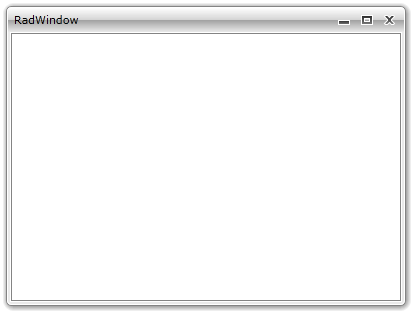
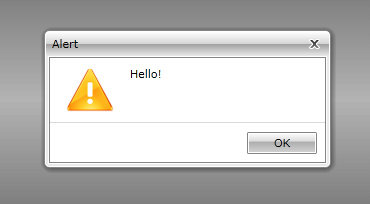
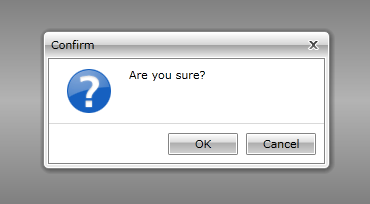
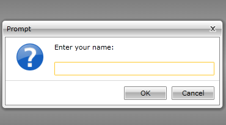

# Getting Started with {{ site.framework_name }} Window

This tutorial will walk you through the creation of a __RadWindow__ and will show you how to:

* [Declare a RadWindow](#declare-a-radwindow)

* [Show the RadWindow](#show-the-radwindow)

* [Add content to the RadWindow](#add-content-to-the-radwindow)

* [Use predefined windows](#use-predefined-windows)

* [Using RadWindow with NoXaml assemblies](#using-radwindow-with-noxaml-assemblies)

## Adding Telerik Assemblies Using NuGet

To use __RadWindow__ when working with NuGet packages, install the `Telerik.Windows.Controls.Navigation.for.Wpf.Xaml` package. The [package name may vary]() slightly based on the Telerik dlls set - [Xaml or NoXaml]()

Read more about NuGet installation in the [Installing UI for WPF from NuGet Package]() article.

>tip With the 2025 Q1 release, the Telerik UI for WPF has a new licensing mechanism. You can learn more about it [here]().

## Adding Assembly References Manually

If you are not using NuGet packages, you can add a reference to the following assemblies:

* __Telerik.Licensing.Runtime__
* __Telerik.Windows.Controls__
* __Telerik.Windows.Controls.Navigation__
* __Telerik.Windows.Data__

You can find the required assemblies for each control from the suite in the [Controls Dependencies]()[Controls Dependencies]() help article.

## Declare a RadWindow

You can add __RadWindow__ manually in XAML as demonstrated if __Example 1__.

#### __[XAML] Example 1: Adding RadWindow in XAML__

{{region xaml-radwindow-getting-started_0}}
	<telerik:RadWindow Height="300" Width="400"/>
{{endregion}}

Here is an example of declaring a __RadWindow__ in code.

#### __[C#] Example 2: Adding RadWindow in code__

{{region cs-radwindow-getting-started_1}}
	RadWindow radWindow = new RadWindow();
	radWindow.Width = 400;
	radWindow.Height = 300;
{{endregion}}

#### __[VB.NET] Example 2: Adding RadWindow in code__

{{region vb-radwindow-getting-started_2}}
	Dim radWindow As New RadWindow()
	radWindow.Width = 400
	radWindow.Height = 300
{{endregion}}

>It's not a good practice do declare your __RadWindow__ as visual element in XAML. The only scenario, when it is meaningful to use the __RadWindow__ in XAML, is when it represents the entire user control. To learn more about that read [here]().

## Show the RadWindow

To open the __RadWindow__ you have to call its __Show()__ method.

>tipIn order to make the window modal you have to call the __ShowDialog()__ method. To learn more about modal windows read [here]().

#### __[C#] Example 3: Calling the Show() method__

{{region cs-radwindow-getting-started_3}}
	radWindow.Show();
{{endregion}}

#### __[VB.NET] Example 3: Calling the Show() method__

{{region vb-radwindow-getting-started_4}}
	radWindow.Show()
{{endregion}}

## Add content to the RadWindow

To add content to the __RadWindow__ you have to use the __Content__ property or the __ContentTemplate__ property.

>tipAs the __Content__ property is of type object you can set it to any control that you like. If you want to have a more complex content that consists of more than one control, be sure to wrap them inside a layout control and pass the layout control as content.You can also set the content of the __RadWindow__ to a __UserControl__.

>tipYou can skip the in-line setting of the __Content__ property and define the content directly under the __RadWindow__ tag.

>The only scenario, where you can add content to the __RadWindow__ at design-time, is when the __RadWindow__ represents an entire user control. To learn more about that read [here]().

#### __[C#] Example 4: Setting the Content property__

{{region cs-radwindow-getting-started_5}}
	Grid grid = new Grid();
	grid.Background = new SolidColorBrush(Color.FromArgb(255, 240, 255, 255));
	radWindow.Content = grid;
{{endregion}}

#### __[VB.NET] Example 4: Setting the Content property__

{{region vb-radwindow-getting-started_6}}
	Dim grid As New Grid()
	grid.Background = New SolidColorBrush(Color.FromArgb(255, 240, 255, 255))
	radWindow.Content = grid
{{endregion}}

## Use predefined windows

There is a set of predefined dialog windows that can be directly used. Such windows are the __Confirm__, __Alert__ and __Prompt__ dialogs. These dialogs can be shown by calling the respective methods of the static __RadWindow__ class.

>All of the predefined windows are modal windows.

* __Alert()__ - shows an alert dialog. This method has 3 overloads. To learn more read [here]().

#### __[C#] Example 5: Using the Alert method__

{{region cs-radwindow-getting-started_7}}
	RadWindow.Alert("Hello!");
{{endregion}}

#### __[VB.NET] Example 5: Using the Alert method__

{{region vb-radwindow-getting-started_8}}
	RadWindow.Alert("Hello!")
{{endregion}}

* __Confirm()__ - shows a confirm dialog. This method has 2 overloads. To learn more read [here]().

#### __[C#] Example 6: Using the Confirm method__

{{region cs-radwindow-getting-started_9}}
	RadWindow.Confirm(new DialogParameters()
	{
	    Content = "Are you sure?"
	});
{{endregion}}

#### __[VB.NET] Example 6: Using the Confirm method__

{{region vb-radwindow-getting-started_10}}
	Dim parameters As New DialogParameters()
	parameters.Content = "Are you sure?"
	RadWindow.Confirm(parameters)
{{endregion}}

* __Prompt()__ - shows a prompt dialog. This method has 3 overloads. To learn more read [here]().

#### __[C#] Example 7: Using the Prompt method__

{{region cs-radwindow-getting-started_11}}
	RadWindow.Prompt(new DialogParameters()
	{
	    Content = "Enter your name:"
	});
{{endregion}}

#### __[VB.NET] Example 7: Using the Prompt method__

{{region vb-radwindow-getting-started_12}}
	Dim parameters As New DialogParameters()
	parameters.Content = "Enter your name:"
	RadWindow.Confirm(parameters)
{{endregion}}

## Using RadWindow with NoXaml assemblies

If you are using [Implicit Styles]() to style the control, note that the newly created user control will not receive automatically the RadWindow style. The __BasedOn__ property of the custom style need to be set to the default style of RadWindow which is __RadWindowStyle__. You should add the following style after the merged dictionaries to fix this:

#### __[XAML] Example 8: Custom Style targeting your RadWindow control__  
{{region xaml-radwindow-getting-started_13}}
	<Application.Resources>
	    <ResourceDictionary>
	        <ResourceDictionary.MergedDictionaries>
	            <ResourceDictionary Source="Themes/System.Windows.xaml" />
	            <ResourceDictionary Source="Themes/Telerik.Windows.Controls.xaml" />
	            <ResourceDictionary Source="Themes/Telerik.Windows.Controls.Navigation.xaml" />
	        </ResourceDictionary.MergedDictionaries>
	        <Style TargetType="local:RadWindowControl" BasedOn="{StaticResource RadWindowStyle}" />
	    </ResourceDictionary>
	</Application.Resources>
{{endregion}}


## Telerik UI for WPF Learning Resources

* [Telerik UI for WPF Window Component](https://www.telerik.com/products/wpf/window.aspx)
* [Getting Started with Telerik UI for WPF Components]()
* [Telerik UI for WPF Installation]()
* [Telerik UI for WPF and WinForms Integration]()
* [Telerik UI for WPF Visual Studio Templates]()
* [Setting a Theme with Telerik UI for WPF]()
* [Telerik UI for WPF Virtual Classroom (Training Courses for Registered Users)](https://learn.telerik.com/learn/course/external/view/elearning/16/telerik-ui-for-wpf) 
* [Telerik UI for WPF License Agreement](https://www.telerik.com/purchase/license-agreement/wpf-dlw-s)


## See Also  
 * [Visual Structure]()
 * [Predefined Dialogs]()
 * [RadWindowManager]()
 * [Events]()
