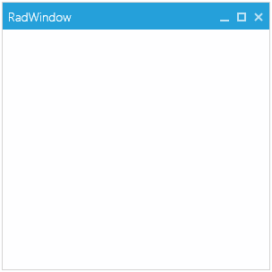

# Change the Default Theme

You can easily change the theme of __RadWindow__ to one of the predefined themes for UI for {{ site.framework_name }} using the [Implicit Styles]() or [StyleManager]()[StyleManager]().

* [Using Implicit Styles](#using-implicit-styles)
* [Using StyleManager](#using-stylemanager)

## Implicit Styles vs. StyleManager

The Implicit Styles theming mechanism has a full design-time support. It is smaller size of dlls because the NoXaml assemblies contain only the code + the styles for a single theme that comes from the theme dlls. Also, you have easier access to the resources and styles for the controls via the StaticResources keyword.

On the other hand the StyleManager is easier to apply. You need only to set the StyleManager.Theme property on the control you want to theme.

## Using Implicit Styles

To change the theme using the implicit styles mechanism you will need to make few steps.

1. Reference the NoXaml version of the Telerik UI for WPF dlls. They can be found in the */Telerik UI for WPF installation folder/Binaries.NoXaml/* folder.
2. Reference a theme dll - for example *Telerik.Windows.Themes.Windows8.dll*.
3. Merge the required .xaml files in the App.xaml file.

	* Telerik.Windows.Controls.xaml
	* Telerik.Windows.Controls.Navigation.xaml

	>As RadWindow is placed in a different visual tree than the UserControl it is opened from, the XAML files should be merged in App.xaml, if you merge them locally in the UserControl Resources, RadWindow will not receive its Style.
	
	The following example shows how to merge the Windows8 theme resources and open a new window.
	
	__Example 1: Merging the required .xaml files for the Windows8 theme__  
	```XAML
		<Application>
			<Application.Resources>
				<ResourceDictionary>
					<ResourceDictionary.MergedDictionaries>
						<ResourceDictionary Source="/Telerik.Windows.Themes.Windows8;component/Themes/Telerik.Windows.Controls.xaml"/>
						<ResourceDictionary Source="/Telerik.Windows.Themes.Windows8;component/Themes/Telerik.Windows.Controls.Navigation.xaml"/>
					</ResourceDictionary.MergedDictionaries>
				</ResourceDictionary>
			</Application.Resources>
		</Application>
	```

	__Example 2: Opening a window__  
	```C#
		var window = new RadWindow()
		{
			Width = 300,
			Height = 300
		};
		window.Show();
	```
	```VB.NET
		Dim newWindow As New RadWindow() With {
			.Width = 300,
			.Height = 300
		}
		newWindow.Show()
	```

	<h4 id="figure-1"><strong>Figure 1: RadWindow with the Windows8 theme applied</strong></h4>
	

If you use __RadWindow__ as a custom UserControl as shown in __Example 3__, you will need to apply a new style targeting the custom control and base it on the default RadWindowStyle. Otherwise, the window won't be displayed.

__Example 3: RadWindow defined as a UserControl__
```XAML
	<telerik:RadWindow x:Class="RadWindowSamples.RadWindowControl"
	   xmlns="http://schemas.microsoft.com/winfx/2006/xaml/presentation"
	   xmlns:x="http://schemas.microsoft.com/winfx/2006/xaml"
	   xmlns:telerik="http://schemas.telerik.com/2008/xaml/presentation">
	</telerik:RadWindow>
```

__Example 4: Adding an implicit style targeting the new window control and based on the default window style__
```XAML
	<Application>
	    <Application.Resources>
	        <ResourceDictionary>
	            <ResourceDictionary.MergedDictionaries>
					<ResourceDictionary Source="/Telerik.Windows.Themes.Windows8;component/Themes/System.Windows.xaml"/>
	                <ResourceDictionary Source="/Telerik.Windows.Themes.Windows8;component/Themes/Telerik.Windows.Controls.xaml"/>
	                <ResourceDictionary Source="/Telerik.Windows.Themes.Windows8;component/Themes/Telerik.Windows.Controls.Navigation.xaml"/>
	            </ResourceDictionary.MergedDictionaries>
	            <Style TargetType="local:RadWindowControl" BasedOn="{StaticResource RadWindowStyle}" />
	        </ResourceDictionary>
	    </Application.Resources>
	</Application>
```

The important part is to set the __TargetType__ property to the type of the UserControl.

>tip Read more about this in the [How to use RadWindow as user control]() article.

## Using StyleManager

To change the theme via the StyleManager you will need to make few steps.

1. Reference the Xaml version of the Telerik UI for WPF dlls. They can be found in the */Telerik UI for WPF installation folder/Binaries/* folder.
2. Set the StyleManager.Theme attached property on the control you want to theme. Or set the StyleManager.ApplicationTheme static property before calling the InitialComponent method of the view or the App.xaml.cs file. This will set the theme globally for all Telerik controls.

	__Example 5: Setting the theme of the window__
	```C#
		var window = new RadWindow()
		{
			Width = 300,
			Height = 300
		};		
		StyleManager.SetTheme(window, new Window8Theme());
		
		window.Show();
	```
	```VB.NET
		Dim window As New RadWindow() With {
			.Width = 300,
			.Height = 300
		}
		StyleManager.SetTheme(window, New Window8Theme())
		
		window.Show()
	```
	
	__Example 6: Setting the theme globally__
	```C#		
		StyleManager.ApplicationTheme = new Window8Theme();
		InitializeComponent();
	```
	```VB.NET		
		StyleManager.ApplicationTheme = New Window8Theme()
		InitializeComponent()
	```

The end result is the same as in [Figure 1](#figure-1).
	
## See Also  
 * [Styling the RadWindow]()
 * [Styling the Predefined Windows]()
