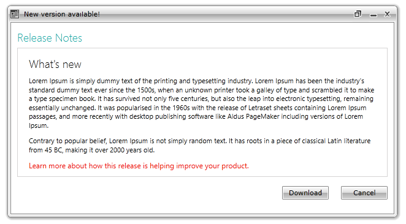
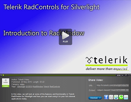

# Overview

## 





Thank you for choosing Telerik __RadWindow__!
        

With Telerik __RadWindow__ you can easily add modal popups to your application.  Draw attention to important information or receive user input. __RadWindow__ lets you create Child and Dialogs Windows, which can have their appearance and content customized.  The control provides a flexible API to easily control its behavior and makes possible the implementation of complex logic for a great range of scenarios.
        

This is a list with short descriptions of the top-of-the-line features of Telerik's __RadWindow__ control:
        

* __Child Windows Across All Platforms and Scenarios__ - Telerik __RadWindow__ makes possible to create Child Windows in Silverlight, WPF and XBAP applications with the same API, functionality and appearance across all platforms and scenarios.
          

* __Predefined Dialogs__ - Telerik __RadWindow__ provides an easy way to replace the standard non-customizable dialog boxes (alert, confirm, and prompt) provided by the browser. With __RadWindow__ you can blend the popup into the application’s design to achieve better user experience. [Read more]()

* __Styling and Appearance__ - Telerik __RadWindow__ is a fully customizable control, which lets you easily modify all its visual elements, such as borders, resize grips, titlebars, buttons, etc. The control comes with several built-in skins that can be customized if needed. [Read more]()

* __Customizable Behavior__ - Telerik __RadWindow__ basic behavior can be configured with a few clicks. You have a full control over determining the initial [state]() of the window and whether it can be [resized]().
          

* __Configuration__ - Telerik __RadWindow__ gives you full freedom to choose its [state]() and [position]() parameters.
          

* __Customizable Content__ - in case of complex scenarios, you can implement any element such as basic shapes, panels and user controls inside the __RadWindow__.
          

* __Silverlight/WPF Code Compatibility__ - Telerik __RadWindow__ shares a single codebase with its WPF counterpart. This means that you can achieve close to 100% code reuse for your modal popus if you have parallel Silverlight/WPF development.
          

* __Codeless Test Automation for RadWindow__ - Now you can record, execute and debug functional tests for __RadWindow__ without leaving the familiar Visual Studio environment. Telerik [WebUI Test Studio](http://www.telerik.com/products/web-testing-tools.aspx) is an advanced click and play web application testing tool specialized for automating both AJAX and Silverlight applications. The Studio ships with special translators for Telerik RadControls for ASP.NET, AJAX and Silverlight.
          
<table><tr><td>

[Link...](http://tv.telerik.com/silverlight/video/introduction-radwindow-silverlight)</td><td>In this video, we will look at some of the features and functionality in Telerik RadWindow for Silverlight and how you can start using it in your rich internet applications today.(Runtime: 03:22)</td></tr></table>

# See Also

 * [Visual Structure]()

 * [Getting Started]()

 * [Working with RadWindow]()

 * [Events]()

 * [End-User Capabilities]()

 * [Styles and Templates - Overview]()
