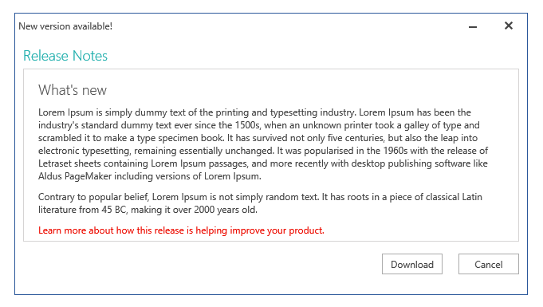

# Overview








Thank you for choosing Telerik __RadWindow__!

With Telerik __RadWindow__ you can easily add modal popups to your application.  Draw attention to important information or receive user input. __RadWindow__ lets you create child and dialog Windows, which can have their appearance and content customized. The control provides a flexible API to easily control its behavior and makes possible the implementation of complex logic for a wide range of scenarios.

This is a list with short descriptions of the top-of-the-line features of Telerik's __RadWindow__ control.

* __Child Windows Across All Platforms__: Telerik __RadWindow__ enables you to create child windows in Silverlight, WPF and XBAP applications with the same API, functionality and appearance across all platforms. The [RadWindowManager]() class makes it easy to control all currently open RadWindows.

* __Predefined Dialogs__: Telerik __RadWindow__ provides an easy way to replace the standard non-customizable dialog boxes (alert, confirm, and prompt) provided by the browser. With __RadWindow__ you can blend the popup into the application’s design to achieve better user experience. [Read more]()

* __Styling and Appearance__: Telerik __RadWindow__ is a fully customizable control, which lets you easily modify all its visual elements. The control comes with several built-in skins that can be customized if needed. [Read more]()

* __Configuration__: Telerik __RadWindow__ can be easily configured to suit the needs of your application. You have a full control over determining the initial [state]() and [position]() of the window, whether it can be [resized](), [closed]() or [moved]().

>tip Get started with the control with its [Getting Started]() help article that shows how to use it in a basic scenario.

> Check out the online demo at [demos.telerik.com](http://demos.telerik.com/silverlight/#Window/FirstLook)[demos.telerik.com](http://demos.telerik.com/wpf/)

## See Also

 * [Visual Structure]()
 * [Getting Started]()
 * [Working with RadWindow]()
 * [Events]()
 * [End-User Capabilities]()
 * [Styles and Templates - Overview]()
