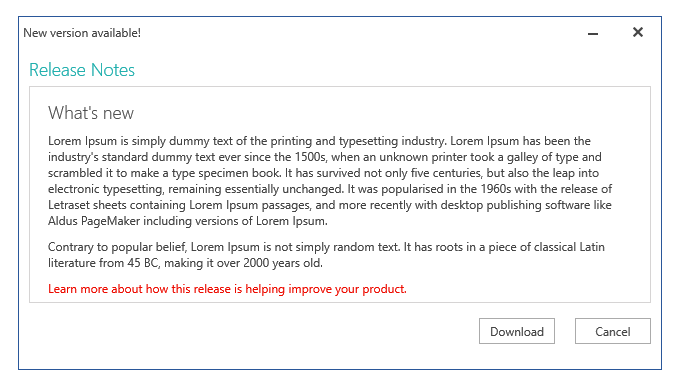

# {{ site.framework_name }} RadWindow Overview

Use `RadWindow` to display modal dialogs, child windows, and reusable popup content inside your application. The control helps you show important information, collect user input, and manage window behavior such as positioning, moving, resizing, and state changes.

This overview explains when to use `RadWindow`, highlights the most useful feature areas, and points you to the best next article for each common task.





## When to Use RadWindow

Use `RadWindow` when your application needs one or more of the following behaviors:

* Show a dialog without leaving the current view.
* Reuse custom popup content in multiple parts of the application.
* Replace default alert, confirm, or prompt dialogs with dialogs that match your application theme.
* Control window state, position, size, and interaction through code.

## Key Features

### Create and Manage Windows

Create `RadWindow` instances in code, show them as standard or modal windows, and manage multiple open windows through [RadWindowManager](). This is the right starting point when you need custom popup workflows or centralized window management.

### Use Predefined Dialogs

Use the built-in alert, confirm, and prompt dialogs when you need quick dialog interactions without building the window content from scratch. See [Predefined Dialogs]() for the available dialog methods and usage patterns.

### Control Window Behavior

Configure the initial state and runtime behavior of the window, including [state](), [position](), [resizing](), [closing](), and [moving]().

### Customize the Appearance

Adapt `RadWindow` to your application theme by modifying the header, icon, and overall visual style. For deeper appearance customization, continue with [Styling the RadWindow]().

## Common Next Steps

Start with the article that matches your immediate goal:

* To create and show your first window, open [Getting Started]().
* To work with the window API in more detail, open [Working with RadWindow]().
* To react to user interaction and state changes, open [Events]().
* To understand how end users can move, resize, and interact with the window, open [End-User Capabilities]().

>tip Get started with the control with its [Getting Started]() help article that shows how to use it in a basic scenario.

>note Explore the online demo at [demos.telerik.com](https://demos.telerik.com/silverlight/#Window/FirstLook)[demos.telerik.com](https://demos.telerik.com/wpf/) to see `RadWindow` behavior before you integrate it into your application.


## Telerik UI for WPF Support and Learning Resources

* [Telerik UI for WPF Window Homepage](https://www.telerik.com/products/wpf/window.aspx)
* [Get Started with the Telerik UI for WPF Window]()
* [Telerik UI for WPF API Reference](https://docs.telerik.com/devtools/wpf/api/)
* [Getting Started with Telerik UI for WPF Components]()
* [Telerik UI for WPF Virtual Classroom (Training Courses for Registered Users)](https://learn.telerik.com/learn/course/external/view/elearning/16/telerik-ui-for-wpf) 
* [Telerik UI for WPF Window Forums](https://www.telerik.com/forums/wpf)
* [Telerik UI for WPF Knowledge Base](https://docs.telerik.com/devtools/wpf/knowledge-base)


## See Also  
 * [Visual Structure]()
 * [Getting Started]()
 * [Working with RadWindow]()
 * [Events]()
 * [End-User Capabilities]()
