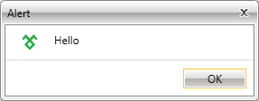

# Styling the Predefined Dialogs

This article explains how you could customize the look and feel of the predefined dialog windows. 

## Modifying the Default Style

To style the predefined dialogs of the __RadWindow__ static class, you have to call them via the overload that takes a __DialogParameters__ object as an argument. Learn more about the predefined dialogs in the [Predefined Dialogs]() article.

In this article's example we will use __RadAlert__, but the approach is the same for __RadConfirm__ and __RadPrompt__.

First, obtain the default style that targets __RadAlert__. See how to do this in the [Editing Control Templates]() topic. The extracted __RadAlertStyle__ will be similar to the following:

__Example 1: Default RadAlertStyle__  
```XAML
	<Style x:Key="RadAlertStyle" TargetType="telerik:RadAlert">
	    <Setter Property="IsTabStop" Value="False"/>
	    <Setter Property="MinWidth" Value="275"/>
	    <Setter Property="MaxWidth" Value="500"/>
	    <Setter Property="SnapsToDevicePixels" Value="True"/>
	    <Setter Property="Template">
	        <Setter.Value>
	            <ControlTemplate TargetType="telerik:RadAlert">
	                <!--...-->
	            </ControlTemplate>
	        </Setter.Value>
	    </Setter>
	</Style>
```

>If you are not using [Implicit Styles]() to style the controls, you will need to copy all the resources referenced (with the StaticResources keyword) in the __RadAlertStyle__ to your project as well (such as AlertIconTemplate).

Now you can make modifications in the template such as removing the OK button, changing the Alert icon, etc.

And finally, pass the customized __RadAlertStyle__ to the predefined dialog via the __DialogParameters__ object and its __ContentStyle__ property.

__Example 2: Applying customized Style to RadAlert__  
```C#
	DialogParameters parameters = new DialogParameters();
	parameters.ContentStyle = this.Resources["RadAlertStyle"] as Style;
	parameters.Content = "Hello";
	RadWindow.Alert(parameters);
```
```VB.NET
	Dim parameters As New DialogParameters()
	parameters.ContentStyle = TryCast(Me.Resources("RadAlertStyle"), Style)
	parameters.Content = "Hello"
	RadWindow.Alert(parameters)
```

#### __Figure 1: RadAlert with custom Style__


## Applying IconTemplate

With the Q1 2016 release of UI for {{ site.framework_name }} the __IconTemplate__ property was introduced. By using it you are now able to easily change the icon of the predefined windows.  

Basically, a valid DataTemplate needs to be created and that Template should be passed to the predefined windows via the __DialogParameters__ and its __IconTemplate__ property.

__Example 3: Defining the DataTemplate__  
```XAML
	<DataTemplate x:Key="IconTemplate">
	    <Image Source="telerik.png" Stretch="Fill" Width="22" Height="22"/>
	</DataTemplate>
```

__Example 4: Applying the DataTemplate to the IconTemplate property__  
```C#
	RadWindow.Alert(new DialogParameters()
	{
	    Content = "Hello",
	    IconTemplate = this.Resources["IconTemplate"] as DataTemplate
	});
```
```VB.NET
	RadWindow.Alert(New DialogParameters() With
	{
	    .Content = "Hello",
	    .IconTemplate = TryCast(Me.Resources("IconTemplate"), DataTemplate
	)})
```

#### __Figure 2: RadAlert with set IconTemplate__


## Modify WindowStyle

You can also modify the appearance of the window which hosts the dialog content. For the purpose, set the **WindowStyle** property of the **DialogParameters** object.

__Example 5: Default RadAlertStyle__  
```XAML
	<Style x:Key="RadAlertWindowStyle" TargetType="telerik:RadWindow">
		<Setter Property="CornerRadius" Value="10"/>
	</Style>
```


__Example 6: Applying the DataTemplate to the IconTemplate property__  
```C#
	RadWindow.Alert(new DialogParameters()
	{
	    Content = "Hello",
	    parameters.WindowStyle = App.Current.Resources["RadAlertWindowStyle"] as Style;
	});
```
```VB.NET
	RadWindow.Alert(New DialogParameters() With
	{
	    .Content = "Hello",
	    .WindowStyle = TryCast(App.Current.Resources("RadAlertWindowStyle"), Style)
	)})
```

## See Also  
 * [Styling the RadWindow]()
 * [Change the Default Theme]()
