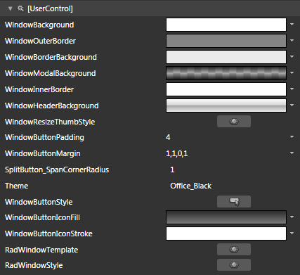
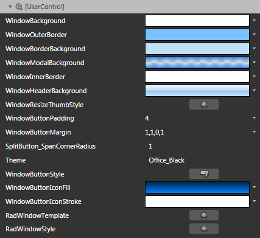
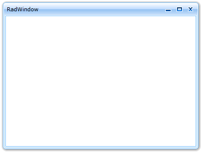

# Styling the RadWindow

>tipBefore reading this topic, you might find it useful to get familiar with the [Template Structure of the RadWindow control]().

The __RadWindow__can be styled by creating an appropriate __Style__ and setting it to the __Style__ property of the control. 

You have two options:

* To create an empty style and set it up on your own.

* To copy the default style of the control and modify it.

This topic will show you how to perform the second one.

## Modifying the Default Style

To copy the default style, load your project in Expression Blend and open the User Control that holds the __RadWindow__. From the 'Assets' pane select the RadWindow control and drawa a dummy instance on the art board. In the 'Objects and Timeline' pane select the dummy __RadWindow__and from the menu choose *Object -> Edit Style -> Edit a Copy*. You will be prompted for the name of the style and where to be placed.

>tipIf you choose to define the style in Application, it would be available for the entire application. This allows you to define a style only once and then reuse it where needed.

After clicking 'OK', Expression Blend will generate the default style of the __RadWindow__control in the __Resources__ section of your User Control. The properties available for the style will be loaded in the 'Properties' pane and you will be able to modify their default values. You can also edit the generated XAML in the XAML View or in Visual Studio.

If you go to the 'Resources' pane, you will see an editable list of resources generated together with the style and used by it. In this list you will find the brushes, styles and templates needed to change the visual appearance of the __RadWindow.__Their names indicate to which part of the __RadWindow__appearance they are assigned.

         
      

* __WindowBackground__ - a brush that represents the background of the __RadWindow's__ content.

* __WindowOuterBorder__ - a brush that represents the outer border color of the __RadWindow__.

* __WindowBorderBackground__ - a brush that represents the border color of the __RadWindow__.

* __WindowModalBackground__ - a brush that represents the modal background behind the __RadWindow__.

* __WindowInnerBorder__ - a brush that represents the inner border color of the __RadWindow__.

* __WindowHeaderBackground__ - a brush that represents the background color of the __RadWindow's__ header.

* __WindowResizeThumbStyle__ - the style applied to the resize __Thumbs__.

* __WindowButtonPadding__ - the padding applied to the content in the __RadWindow's__ buttons.

* __WindowButtonMargin__ - the margin applied to the content in the __RadWindow's__ buttons.

* __WindowButtonStyle__ - the Style applied to the __RadWindow's__ buttons.

* __WindowButtonIconFill__ - a brush that represents, the fill of the icons in the __RadWindow's__ buttons.

* __WindowButtonIconStroke__ - a brush that represents the stroke around the icons in the __RadWindow's__ buttons.

* __RadWindowTemplate__ - the __ControlTemplate__ of the __RadWindow__.

* __RadWindowStyle__ - the default __Style__ applied to the __RadWindow__.

>tipChanging the value of the resources can be done by clicking on the color indicator or the icon next to them.

Modify the resource to bring the desired appearance of the __RadWindow__. 

         
      

Finally remove the __dummy__ instance of the __RadWindow__ form the XAML and set the __Style__ to the desired __RadWindow__ instance.

#### __C#__

{{region radwindow-styles-and-templates-styling-the-radwindow_0}}
	RadWindow radWindow = new RadWindow();
	radWindow.Style = this.Resources[ "RadWindowStyle" ] as Style;
	{{endregion}}

#### __VB.NET__

{{region radwindow-styles-and-templates-styling-the-radwindow_1}}
	Dim radWindow As New RadWindow()
	radWindow.Style = TryCast(Me.Resources("RadWindowStyle"), Style)
	{{endregion}}

Here is a snapshot of the result.

         
      

# See Also

 * [Template Structure]()

 * [Styling the Predefined Windows]()

 * [Visual Structure]()
