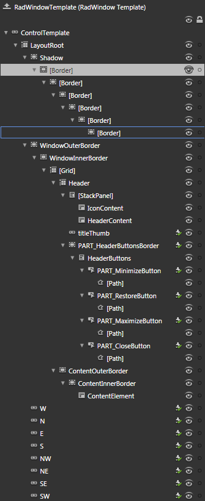

# Template Structure

Like most SilverlightWPF controls, the __RadWindow__ also allows you to template it in order to change the control from the inside. Except for templating the whole control, you can template only parts of it or even independent controls related to it. This topic will make you familiar with the structure of the __RadWindow__'s template. Here is a snapshot of the template generated in Expression Blend.

It contains the following parts:

* __LayoutRoot__ - hosts the elements of the __RadWindow's__ template and is of type __Grid__.

	* __Shadow__ - hosts the elements of the __RadWindow's__ shadow and is of type __Border__.

		* __[Border]__ - takes part in the __RadWidnow's__ shadow and is of type __Border__.

			* __[Border]__ - takes part in the __RadWidnow's__ shadow and is of type __Border__.

				* __[Border]__ - takes part in the __RadWidnow's__ shadow and is of type __Border__.

					* __[Border]__ - takes part in the __RadWidnow's__ shadow and is of type __Border__.

						* __[Border]__ - takes part in the __RadWidnow's__ shadow and is of type __Border__.

							* __[Border]__ - takes part in the __RadWidnow's__ shadow and is of type __Border__.

* __WindowOuterBorder__ - represents the outer border of the __RadWindow__, hosts the elements of the __RadWindow__ and is of type __Border__.

	* __WindowInnerBorder__ - represents the inner border of the __RadWindow__ and is of type __Border__.

		* __[Grid]__ - hosts the layout of the __RadWindow__ content and header, and is of type __Grid__.

			* __Header__ - hosts the header elements and is of type __Grid__.

				* __[StackPanel]__ - hosts the icon and the title, and is of type __StackPanel__.

					* __IconContent__ - represents the content for the __Icon__ and is of type __ContentPresenter__.

					* __HeaderContent__ - represents the content for the __Header__ and is of type __ContentPresenter__.

				* __titleThumb__ - handles the dragging of the __RadWindow__ and is of type __Thumb__.

				* __PART_HeaderButtonsBorder__ - hosts the buttons in the __RadWindow's__ header and is of type __Border__.

					* __HeaderButtons__ - orders the buttons in the __RadWindow's__ header and is of type __StackPanel__.

						* __PART_MinimizeButton__ - represents the button that minimizes the __RadWindow__ and is of type __Button__.

							* __[Path]__ - represents the figure inside the button and is of type __Path__.

						* __PART_RestoreButton__ - represents the button that restores the __RadWindow__ and is of type __Button__.

							* __[Path]__ - represents the figure inside the button and is of type __Path__.

						* __PART_MaximizeButton__ - represents the button that maximizes the __RadWindow__ and is of type __Button__.

							* __[Path]__ - represents the figure inside the button and is of type __Path__.

						* __PART_CloseButton__ - represents the button that closes the __RadWindow__ and is of type __Button__.

							* __[Path]__ - represents the figure inside the button and is of type __Path__.

		* __ContentOuterBorder__ - hosts the content of the __RadWindow,__  represents the content's outer border and is of type __Border__.

			* __ContentInnerBorder__ - represents the inner border of the content and is of type __Border__.

				* __ContentElement__ - represents the content of the __RadWindow__ and is of type __ContentPresenter__.

* __W__ - handles the resizing of the __RadWindow__ to the west and is of type __Thumb__.

* __N__ - handles the resizing of the __RadWindow__ to the north and is of type __Thumb__.

* __E__ - handles the resizing of the __RadWindow__ to the east and is of type __Thumb__.

* __S__ - handles the resizing of the __RadWindow__ to the south and is of type __Thumb__.

* __NW__ - handles the resizing of the __RadWindow__ to the north-west and is of type __Thumb__.

* __NE__ - handles the resizing of the __RadWindow__ to the north-east and is of type __Thumb__.

* __SE__ - handles the resizing of the __RadWindow__ to the south-east and is of type __Thumb__.

* __SW__ - handles the resizing of the __RadWindow__ to the south-west and is of type __Thumb__.

# See Also

 * [Visual Structure]()

 * [Styling the RadWindow]()

 * [Styling the Predefined Windows]()

 * [Change the Default Theme]()
