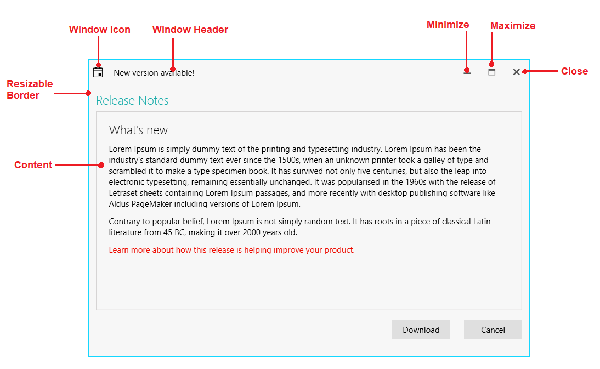

# Visual Structure

This section defines the terms and concepts used in the scope of __RadWindow__ you have to get familiar with prior to continue reading this help. They can also be helpful when contacting our support service in order to describe your issue better. Below you can see snapshots and explanations of the main states and visual elements of the standard __RadMenu__ control.

* __Content__: Represents the inner content. [Read more]()

* __Window Icon__: Represents the container for the icon image of the __RadWindow__. [Read more]()

* __Window Header__: Represents the header of the __RadWindow__. [Read more]()

* __Minimize__: Represents the button that minimizes the __RadWindow__ whenever it is clicked. [Read more]()

* __Maximize__: Represents the button that maximizes the __RadWindow__. [Read more]()

* __Close__: Represents the button that closes the __RadWindow__. [Read more]()

* __Resizable Border__: Resizes the __RadWindow__ along the X and Y axes. [Read more]()

## See Also  
 * [Working with RadWindow]()